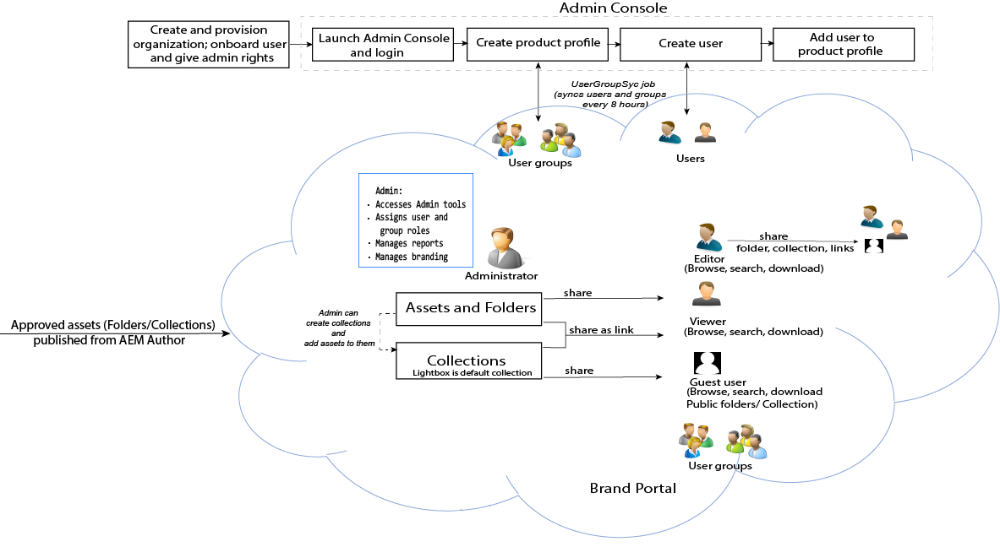

# Introducción

Brand Portal ayuda a las organizaciones a satisfacer sus necesidades de marketing mediante la distribución segura de recursos de productos y marcas aprobados a agencias externas, socios, equipos internos y distribuidores para su descarga.

Si no hay una solución segura para compartir recursos puede conllevar lo siguiente:

* Uso compartido de recursos manual mediante el correo electrónico o la nube
* Problemas de cumplimiento normativo de la marca
* Falta de control sobre el uso de los recursos
* Retrasos en campañas y presentaciones de productos
* Contenido duplicado en ubicaciones geográficas y organizaciones
* Almacenamiento sin protección de los recursos antes de su lanzamiento

Gracias a Brand Portal, las organizaciones pueden garantizar que la marca cumple la normativa al permitir que los especialistas en marketing colaboren con los partners del canal y los usuarios internos de la empresa para crear, administrar y distribuir rápidamente las instrucciones de diseño, los logotipos, las campañas y los recursos de productos más recientes a los interesados.
Brand Portal es una oferta de SAAS basada en la nube. Está disponible como complemento del producto Adobe Experience Manager Assets (versión local o servicio administrado).

En la siguiente imagen, aparece la solución del flujo de trabajo de Brand Portal.

## Guía del usuario de Adobe Experience Manager Brand Portal

En esta guía se muestran los detalles de las ofertas y los flujos de trabajo claves de Brand Portal. Utilice el raíl izquierdo para ver varias funcionalidades y explorar en profundidad la variedad de personas que interactúan con el portal.

### Consulte también

| Guía del usuario | Descripción |
|--- |---|
| [Novedades](whats-new.md) | Qué ha cambiado y cuáles son las últimas ofertas que se pueden encontrar en las versiones anteriores de Brand Portal. |
| [Notas de la versión](brand-portal-release-notes.md) | En la versión actual encontrará mejoras y soluciones a problemas graves y conocidos. |
| [Configurar AEM Assets con Brand Portal](../using/configure-aem-assets-with-brand-portal.md) | Cómo duplicar Brand Portal con AEM Assets para publicar recursos. |
| [Solucionar problemas en una publicación paralela](troubleshoot-parallel-publishing.md) | Solucionar la replicación entre Brand Portal y AEM Assets. |
| [Formatos de archivo admitidos](brand-portal-supported-formats.md) | Formatos de archivo admitidos en Brand Portal para su previsualización y descarga. |
| [Publicar recursos en Brand Portal](brand-portal-sharing-folders.md) | Cómo publicar carpetas, colecciones, vínculos, ajustes preestablecidos, esquemas, facetas y etiquetas en Brand Portal. |
| [Origen de recursos en Brand Portal](brand-portal-asset-sourcing.md) | Cómo configurar la fuente de recursos en Recursos AEM, cargar recursos en Brand Portal y publicar la carpeta de contribución en Recursos AEM. |

### Recursos útiles

* [Explicación de Brand Portal con AEM Assets](https://docs.adobe.com/content/help/en/experience-manager-brand-portal/using/home.html)
