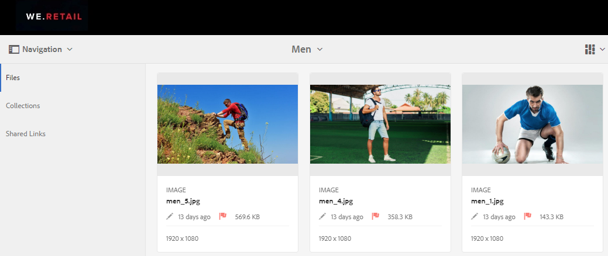
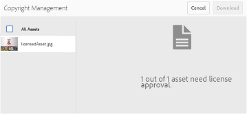
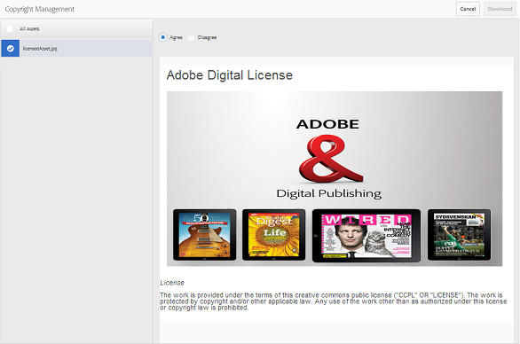
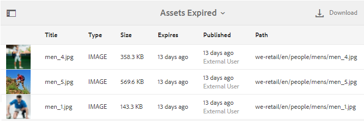

# Administración de derechos digitales de recursos {#manage-digital-rights-of-assets}

Garantizar la distribución segura y el uso de los recursos creativos y del material de marca es vital para proteger su marca. Esto puede aplicarse en toda la organización y fuera asociando una fecha de caducidad (y hora) con los recursos aprobados publicados de AEM a Brand Portal o mediante la licencia de estos recursos para su uso condicional. Además, Brand Portal le permite especificar una fecha de caducidad para los vínculos a los recursos compartidos desde Brand Portal.

Lea cómo se asegura de que los recursos están protegidos en Brand Portal y comprenda los permisos de uso asociados.

## Caducidad de recursos {#asset-expiration}

La caducidad de recursos es una manera eficaz de controlar el uso de los recursos aprobados en Brand Portal en una organización. Todos los recursos publicados de AEM Assets a Brand Portal pueden tener una fecha de caducidad, lo que restringe el uso de estos recursos por diferentes funciones de usuario.

### Permisos de uso relacionados con recursos caducados {#usage-permissions-expired-assets}

En Brand Portal, los administradores pueden ver, descargar y agregar recursos caducados a colecciones. Mientras que Editores y Visores solo pueden ver y agregar recursos caducados a colecciones.

Los administradores pueden publicar recursos caducados de AEM Assets en Brand Portal. Sin embargo, los recursos caducados no se pueden compartir mediante tinta desde Brand Portal. Si selecciona cualquier recurso caducado de una carpeta que contenga recursos tanto caducados como no caducados, la acción **[!UICONTROL Compartir vínculo]** no estará disponible. Sin embargo, si selecciona una carpeta que contiene recursos caducados y no caducados, las acciones [!UICONTROL Compartir] y **[!UICONTROL Compartir vínculos]** están disponibles.

>[!NOTE]
>
>Una carpeta puede compartirse como vínculo, incluso si contiene recursos caducados. En este caso, el vínculo no enumera los recursos caducados y solo se comparten los recursos no caducados.

En la tabla siguiente se muestran los permisos de uso de los recursos caducados:

|  | **[!UICONTROL Compartir vínculos]** | **[!UICONTROL Descargar]** | **[!UICONTROL Propiedades]** | **[!UICONTROL Agregar a la colección]** | **[!UICONTROL Eliminar]** |
|---|---|---|---|---|---|
| **[!UICONTROL Administrador]** | No disponible | Disponible | Disponible | Disponible | Disponible |
| **[!UICONTROL Editor]** | No disponible | No disponible | Disponible | Disponible | No disponible |
| **[!UICONTROL Visor]** | No disponible | No disponible | Disponible | Disponible | No disponible |
| **[!UICONTROL Usuario invitado]** | No disponible | No disponible | Disponible | Disponible | No disponible |

>[!NOTE]
>
>Si los editores y editores descargan una carpeta que contiene recursos caducados y no caducados, solo se descargarán los recursos no caducados. Si una carpeta solo contiene recursos caducados, se descarga una carpeta vacía.

### Estado de caducidad de los recursos {#expiration-status-of-assets}

Puede ver el estado de caducidad de los recursos en su vista [!UICONTROL de tarjeta]. Un indicador rojo en la tarjeta indica que el recurso ha caducado.

>[!NOTE]
>
>Las vistas de lista y columnas no muestran el estado de caducidad de los recursos.

## Caducidad del vínculo de recursos {#asset-link-expiration}

Aunque se comparten recursos mediante vínculos, los administradores y editores pueden establecer una fecha y hora de caducidad utilizando el campo **[!UICONTROL Caducidad]** del cuadro **[!UICONTROL de]** diálogo Compartir vínculos. La caducidad predeterminada del vínculo es de siete días desde la fecha en que se comparte el vínculo.

Garantiza que los recursos compartidos a medida que los vínculos caduquen en la fecha y hora establecidas por los administradores y editores de Brand Portal, no se podrán ver ni descargar más allá de la fecha de caducidad. Dado que los recursos compartidos a través de los vínculos también pueden ser vistos por usuarios externos que no forman parte de la organización, especificando la caducidad puede asegurarse de que los recursos aprobados están protegidos y no expuestos a entidades desconocidas más allá de un tiempo especificado.

Para obtener más información sobre el uso compartido de vínculos, consulte [Compartir recursos como vínculo](../using/brand-portal-link-share.md).

## Recursos con licencia {#licensed-assets}

Los recursos con licencia están sujetos a la aceptación de un contrato de licencia previo a la descarga de Brand Portal. Este acuerdo para recursos con licencia se produce cuando descarga directamente el recurso desde Brand Portal o a través de un vínculo compartido. Si caducan o no, todos los usuarios podrán ver los recursos protegidos por licencia. Sin embargo, la descarga y el uso de los recursos con licencia caducada son limitados. Para conocer el comportamiento de los recursos con licencia caducados y las actividades permisibles basadas en funciones de usuario, consulte permisos [de uso de recursos caducados](../using/manage-digital-rights-of-assets.md#usage-permissions-expired-assets).

Los recursos protegidos por licencia tienen [un acuerdo de licencia asociado](https://helpx.adobe.com/experience-manager/6-5/assets/using/drm.html#DigitalRightsManagementinAssets) a ellos, que se realiza estableciendo la propiedad [de metadatos del recurso](https://helpx.adobe.com/experience-manager/6-5/assets/using/drm.html#DigitalRightsManagementinAssets) en Recursos AEM.

Si elige descargar recursos protegidos por licencias, se le redirigirá a [!UICONTROL la página Administración] de copyright.

Aquí debe seleccionar el recurso para descargar y aceptar el contrato de licencia asociado. Si no acepta el contrato de licencia, el botón [!UICONTROL Descargar] no estará habilitado.

Si la selección contiene varios recursos protegidos, seleccione uno a la vez, acepte el contrato de licencia y proceda a descargar el recurso.

## Generar informe sobre recursos caducados {#generate-report-about-expired-assets}

Los administradores pueden generar y descargar un informe que enumera todos los recursos en un lapso de tiempo específico. Este informe incluye información detallada, como tamaño, tipo, ruta que especifica la ubicación del recurso en la jerarquía de recursos, cuándo caducó el recurso y cuándo se publicó el recurso— acerca de los recursos caducados. Las columnas de este informe se pueden personalizar para mostrar más datos según los requisitos del usuario.

Para obtener más información sobre la característica Informes, consulte [Trabajo con informes](../using/brand-portal-reports.md#work-with-reports).
