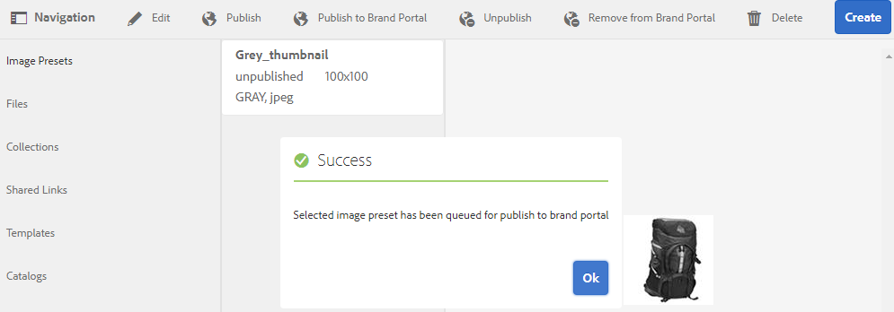
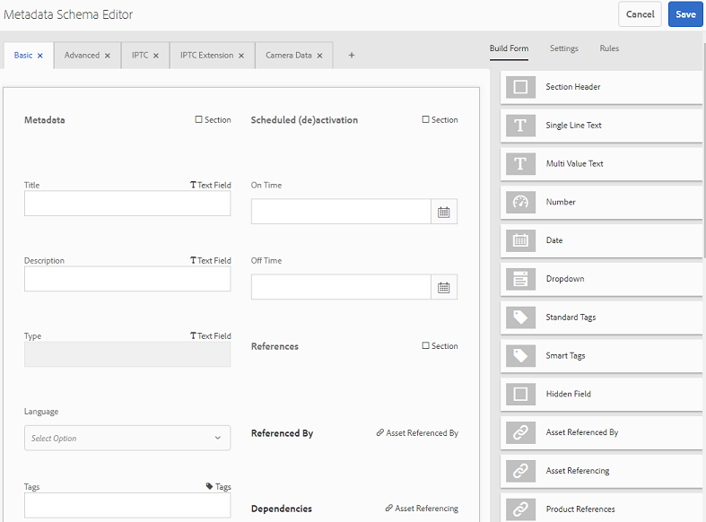
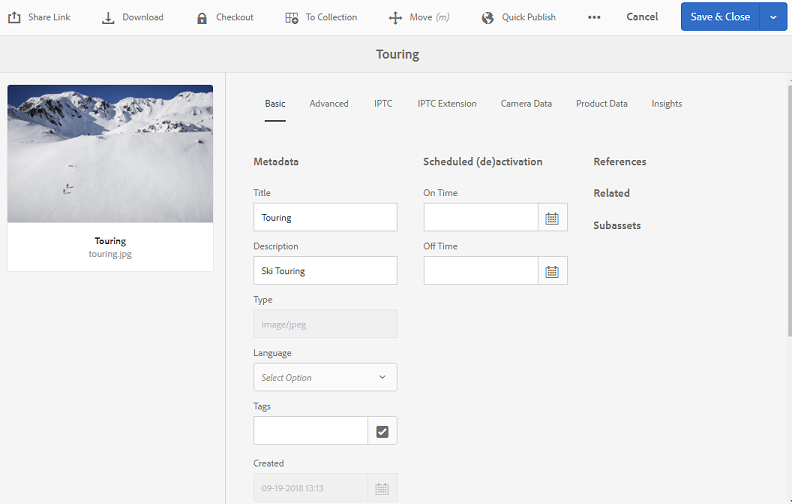
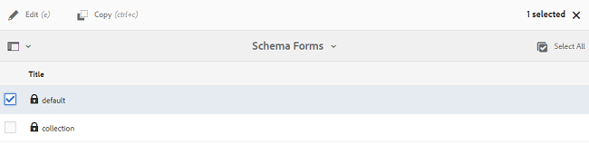
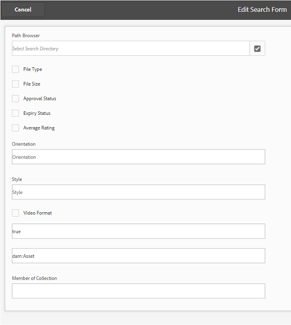
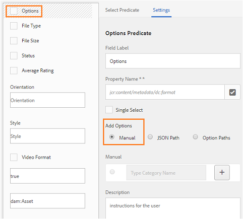

# Publicar ajustes preestablecidos, esquema y facetas en Brand Portal {#publish-presets-schema-and-facets-to-brand-portal}

El artículo busca en la publicación ajustes preestablecidos de imagen, esquemas de metadatos y facetas de búsqueda personalizadas desde [!DNL AEM] la instancia de Autor. [!DNL Brand Portal] La capacidad de publicación permite a las organizaciones reutilizar los ajustes preestablecidos de imagen, esquemas de metadatos y facetas de búsqueda creadas o modificadas en [!DNL AEM] la instancia de Autor, reduciendo así los esfuerzos duplicados.

>[!NOTE]
>
>La capacidad para publicar ajustes preestablecidos de imagen, esquemas de metadatos y facetas de búsqueda desde [!DNL AEM] instancias de autor a [!DNL Brand Portal] está disponible [!DNL AEM 6.2 SP1-CFP7] y [!DNL AEM 6.3 SP 1-CFP 1 (6.3.1.1)] a partir de ahora.

## Publicación de ajustes preestablecidos de imagen en Brand Portal {#publish-image-presets-to-brand-portal}

Los ajustes preestablecidos de imagen son un conjunto de comandos de tamaño y formato que se aplican a la imagen en el momento del envío de imágenes. Los ajustes preestablecidos de imagen se pueden crear y modificar en [!DNL Brand Portal]. Alternativamente, si [!DNL AEM] la instancia de Autor se ejecuta en modo de medios dinámicos, los usuarios pueden crear ajustes preestablecidos en [!DNL AEM] Autor y publicarlos [!DNL AEM Assets Brand Portal], y evitar la recreación de los mismos ajustes preestablecidos en [!DNL Brand Portal].\
Una vez creado el ajuste preestablecido, aparece como representación dinámica en el carril de representación de detalles del recurso y en el cuadro de diálogo Descargar.

>[!NOTE]
>
>Si [!DNL AEM] la instancia de Autor no se está ejecutando en [!DNL Dynamic Media] Modo (el cliente no ha comprado [!DNL Dynamic Media]), la [!UICONTROL representación Pyramid TIFF] de los recursos no se crea en el momento de la carga. Los ajustes preestablecidos de imagen o las representaciones dinámicas funcionan en [!UICONTROL Pyramid TIFF] de un recurso, por lo que si [!UICONTROL Pyramid TIFF] no está disponible en [!DNL AEM] la instancia de autor, también no estará [!DNL Brand Portal] disponible. Como resultado de esto, no hay representaciones dinámicas en el carril de representaciones de la página de detalles del recurso y de descarga.

Para publicar ajustes preestablecidos de imagen en [!DNL Brand Portal]:

1. En la instancia [!DNL AEM] de autor, toque o haga clic en [!DNL AEM] el logotipo para acceder a la consola de navegación global, toque o haga clic en el icono Herramientas y vaya a **[!UICONTROL Recursos]** &gt; Ajustes preestablecidos **[!UICONTROL de imagen]**.
2. Seleccione el ajuste preestablecido de imagen o varios ajustes preestablecidos de imagen en la lista de ajustes preestablecidos de imagen y toque o haga clic **[!UICONTROL en Publicar en Brand Portal]**.

>[!NOTE]
>
>Cuando los usuarios hacen clic en **[!UICONTROL Publicar en Brand Portal]** , los ajustes preestablecidos de imagen se ponen en cola para publicación. Se recomienda a los usuarios controlar el registro de los agentes de replicación para confirmar si la publicación se ha realizado correctamente.

Para cancelar la publicación de un ajuste preestablecido de imagen de [!DNL Brand Portal]:

1. En la instancia [!DNL AEM] de autor, toque o haga clic en [!DNL AEM] el logotipo para acceder a la consola de navegación global, toque o haga clic en el icono Herramientas y vaya a **[!UICONTROL Recursos]** &gt; Ajustes preestablecidos **[!UICONTROL de imagen]**.
2. Seleccione un ajuste preestablecido de imagen y seleccione **[!UICONTROL Quitar de Brand Portal]** desde las opciones disponibles en la parte superior.

## Publicación del esquema de metadatos en Brand Portal {#publish-metadata-schema-to-brand-portal}

El esquema de metadatos describe el diseño y las propiedades que se muestran en la página de propiedades de recursos/colecciones.

 

Si los usuarios han editado el esquema predeterminado en [!DNL AEM] la instancia de Autor y están dispuestos a utilizar el mismo esquema como esquema predeterminado en [!DNL Brand Portal], simplemente pueden publicar los formularios de esquemas de metadatos a [!DNL Brand Portal]. En este escenario, el esquema predeterminado está [!DNL Brand Portal] sobrecargado por los esquemas predeterminados publicados desde [!DNL AEM] la instancia de Autor.

Si los usuarios han creado un esquema personalizado en [!DNL AEM] la instancia de Autor, pueden publicar el esquema personalizado en [!DNL Brand Portal] lugar de volver a crear el mismo esquema personalizado allí. Los usuarios pueden aplicar este esquema personalizado a cualquier carpeta o colección de [!DNL Brand Portal].

>[!NOTE]
>
>Los esquemas predeterminados no se pueden publicar en [!DNL Brand Portal] el caso si se bloquean en [!DNL AEM] la instancia (es decir, no se editan).

>[!NOTE]
>
>Si una carpeta tiene un esquema aplicado a la instancia [!DNL AEM] de Autor, también debe existir el mismo esquema [!DNL Brand Portal] para mantener la coherencia en la página de propiedades del recurso en [!DNL AEM] Autor y [!DNL Brand portal].

Para publicar un esquema de metadatos de [!DNL AEM] la instancia de Autor a [!DNL Brand Portal]:

1. En la instancia [!DNL AEM] de autor, toque o haga clic en el logotipo de AEM para acceder a la consola de navegación global y toque o haga clic en el icono Herramientas y vaya a **[!UICONTROL Recursos]** &gt; **[!UICONTROL Esquemas de metadatos]**.
2. Seleccione un esquema de metadatos y seleccione **[!UICONTROL Publicar en Brand Portal]** desde las opciones disponibles en la parte superior.

>[!NOTE]
>
>Cuando los usuarios hacen clic **[!UICONTROL en Publicar en Brand Portal]**, los esquemas de metadatos se ponen en cola para la publicación. Se recomienda a los usuarios controlar el registro de los agentes de replicación para confirmar si la publicación se ha realizado correctamente.

Para cancelar la publicación de un esquema de metadatos de [!DNL Brand Portal]:

1. En la instancia [!DNL AEM] de autor, toque o haga clic en [!DNL AEM] el logotipo para acceder a la consola de navegación global, toque o haga clic en el icono Herramientas y vaya a **[!UICONTROL Recursos]** &gt; **[!UICONTROL Esquemas de metadatos]**.
2. Seleccione un esquema de metadatos y seleccione **[!UICONTROL Quitar de Brand Portal]** desde las opciones disponibles en la parte superior.

## Publicar facetas de búsqueda en Brand Portal {#publish-search-facets-to-brand-portal}

Los formularios de búsqueda proporcionan la capacidad [de realizar búsquedas por facetas](../using/brand-portal-search-facets.md) a los usuarios [!DNL Brand Portal]. Las facetas de búsqueda proporcionan una granularidad mayor para realizar búsquedas [!DNL Brand Portal]. Todos los [predicados agregados](https://helpx.adobe.com/experience-manager/6-5/assets/using/search-facets.html#AddingaPredicate) en el formulario de búsqueda están disponibles para los usuarios como facetas de búsqueda en los filtros de búsqueda.

Si está dispuesto a utilizar la búsqueda personalizada **[!UICONTROL de Recursos de búsqueda de administrador]** desde la instancia [!DNL AEM] Autor, en vez de volver a crear el mismo formulario en el [!DNL Brand Portal] que puede publicar el formulario de búsqueda personalizado de la instancia [!DNL AEM] de Autor, [!DNL Brand Portal]puede publicar el formulario de búsqueda personalizado.

>[!NOTE]
>
>La búsqueda bloqueada del **[!UICONTROL raíl de búsqueda de recursos]** en Recursos AEM no se puede publicar a [!DNL Brand Portal] menos que se edite. Una vez editado y publicado, [!DNL Brand Portal]este formulario de búsqueda anula [!DNL Brand Portal]el formulario de búsqueda.

Para publicar la faceta de búsqueda editada de [!DNL AEM] la instancia de Autor a [!DNL Brand Portal]:

1. Toque o haga clic en [!DNL AEM] el logotipo y vaya a **[!UICONTROL Herramientas]** &gt; **[!UICONTROL General]** &gt; **[!UICONTROL Buscar formularios]**.
2. Seleccione el formulario de búsqueda editado y seleccione **[!UICONTROL Publicar en Brand Portal]**.

   >[!NOTE]
   >
   >Cuando los usuarios hacen clic **[!UICONTROL en Publicar en Brand Portal]**, las facetas de búsqueda se ponen en cola para publicación. Se recomienda a los usuarios controlar el registro de los agentes de replicación para confirmar si la publicación se ha realizado correctamente.

Para cancelar la publicación de formularios de búsqueda de [!DNL Brand Portal]:

1. En la instancia [!DNL AEM] de autor, toque o haga clic en [!DNL AEM] el logotipo para acceder a la consola de navegación global y toque o haga clic en el icono Herramientas y vaya a **[!UICONTROL General]** &gt; **[!UICONTROL Buscar formularios]**.
2. Seleccione el formulario de búsqueda y seleccione **[!UICONTROL Quitar de Brand Portal]** desde las opciones disponibles en la parte superior.

>[!NOTE]
>
>La acción **[!UICONTROL Cancelar publicación de Brand Portal]** deja el formulario de búsqueda predeterminado en Brand Portal y no restaura al último formulario de búsqueda utilizado antes de la publicación.

### Restricciones {#limitations}

1. Algunos predicados de búsqueda no son aplicables a los filtros de búsqueda en [!DNL Brand Portal]la. Cuando se publican estos predicados de búsqueda como parte del formulario de búsqueda de [!DNL AEM] la instancia de Autor, [!DNL Brand Portal]se filtran. Por lo tanto, los usuarios ven menos cantidad de predicados en el formulario publicado en [!DNL Brand Portal]la. Consulte [los predicados de búsqueda aplicables a filtros en Brand Portal](../using/brand-portal-search-facets.md#list-of-search-predicates).

2. Para [!UICONTROL predicado Opciones] , si un usuario utiliza cualquier ruta personalizada para leer opciones en la instancia de AEM Author, no funcionará en Brand Portal. Estas rutas y opciones adicionales no se publican en Brand Portal con el formulario de búsqueda. En este caso, los usuarios pueden seleccionar **[!UICONTROL la]** opción Manual en **[!UICONTROL Agregar opciones]** dentro **[!UICONTROL de Predicado de opciones]** para agregar estas opciones manualmente en [!DNL Brand Portal].

