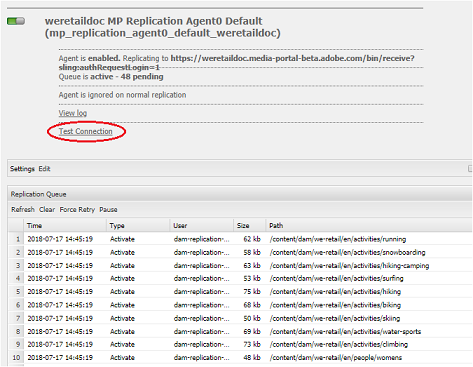

# Solucionar problemas de publicación paralela en Brand Portal {#troubleshoot-issues-in-parallel-publishing-to-brand-portal}

Brand Portal admite la integración con Recursos AEM para que los recursos de marca aprobados se transfieran (o publiquen) sin problemas desde la instancia de creación de Recursos AEM. Una vez [integrado](https://helpx.adobe.com/experience-manager/6-5/assets/using/brand-portal-configuring-integration.html), AEM Author utiliza un agente de replicación para replicar los recursos seleccionados en el servicio en la nube de Brand Portal para que los usuarios de Brand Portal los utilicen de forma aprobada. Multiple replication agents are used AEM 6.2 SP1-CFP5], AEM CFP 6.3.0.2, and onwards to allow high-speed parallel publishing.

>[!NOTE]
>
>Adobe recomienda actualizar a AEM 6.4.1.0 para garantizar que AEM Assets Brand Portal se integre correctamente con Recursos AEM. Una limitación en AEM 6.4 produce un error al configurar la integración con Brand Portal y falla la replicación.

Al configurar el servicio en la nube para el portal de marca en [!UICONTROL /etc/cloudservice], todos los usuarios y tokens necesarios se generan automáticamente y se guardan en el repositorio. Se crea la configuración del servicio en la nube, también se crean los usuarios de servicio necesarios para los agentes de replicación y replicación para replicar contenido. Esto crea cuatro agentes de replicación. So when you publish numerous assets from AEM to Brand Portal, these are queued and distributed among these replication agents through Round Robin.

However, publishing can fail intermittently due to- large sling jobs, increased Network and Disk I/O on AEM Author instance, or slowed performance of AEM Author instance.  It is, therefore, advised to test the connection with the replication agent(s) prior to begin publishing.

## Troubleshoot failures in first time publishing: validating your publish configuration {#troubleshoot-failures-in-first-time-publishing-validating-your-publish-configuration}

To validate your publish configurations:

1. Compruebe los registros de errores
2. Check whether the replication agent is created
3. Probar conexión

**Tail logs while creating Cloud Service**

Check tail logs. Check whether the replication agent is created or not. If the replication agent creation fails, edit the cloud service by making minor changes in cloud service. Validate and check again whether the replication agent is created or not. If not, re-edit the service.

If on repeatedly editing the cloud service it is not configured properly, report a daycare ticket.

**Test connection with replication agents**

Ver registro, si se encuentran errores en el registro de replicación:

1. Póngase en contacto con la asistencia de Adobe.

2. Intente [limpiar](../using/troubleshoot-parallel-publishing.md#clean-up-existing-config) y vuelva a crear la configuración de publicación.

<!--
Comment Type: remark
Last Modified By: Mini Gulati (mgulati)
Last Modified Date: 2018-06-21T22:56:21.256-0400

?? check and compare public key. At times public key is different

?? another thing to check in /useradmin

-->

### Limpiar las configuraciones de publicación existentes de Brand Portal {#clean-up-existing-config}

La mayoría de las veces, cuando la publicación no funciona, el motivo puede ser que el usuario que la publica (por ejemplo: [!UICONTROL mac-&lt;tenantid&gt;-Replication]) no tiene la clave privada más reciente y, por lo tanto, la publicación falla con el error "401 no autorizado" y no se notifica ningún otro error en los registros del agente de replicación. Es posible que desee evitar la resolución de problemas y crear una nueva configuración. Para que la nueva configuración funcione correctamente, limpie lo siguiente de la configuración del autor de AEM:

1. vaya a [!UICONTROL localhost:4502/crx/de] (teniendo en cuenta que está ejecutando la instancia de autor en [!UICONTROL localhost:4502]):\
   i. delete /etc/replication/agents.author/mp_Replication*\
   ii. delete /etc/cloudservices/mediaportal/&lt;nombre_de_configuración&gt;

2. vaya a [!UICONTROL localhost:4502/useradmin]:\
   busco el usuario [!UICONTROL mac-&lt;tenantid&gt;-replicationii eliminar este usuario

Ahora todo el sistema está limpio. Ahora puede intentar crear una nueva configuración de cloudservice y seguir usando la aplicación JWT ya existente en [https://legacy-oauth.cloud.adobe.io/](https://legacy-oauth.cloud.adobe.io/). No es necesario crear una nueva aplicación, sino que solo es necesario actualizar la clave pública desde la configuración de nube recién creada.

## Problema de visibilidad del inquilino de la aplicación JWT de conexión de desarrollador {#developer-connection-jwt-application-tenant-visibility-issue}

Si se encuentra en [https://legacy-oauth.cloud.adobe.io/](https://legacy-oauth.cloud.adobe.io/), se muestran todas las organizaciones (inquilinos) para las que los usuarios actuales tienen administrador del sistema. If you don't find the org name here or you can't create an application for a required tenant here, please check if you have sufficient (system administrator) rights to do this.

Hay un problema conocido en esta interfaz de usuario que indica que para cualquier inquilino solo están visibles las 10 aplicaciones principales. Cuando cree la aplicación, permanezca en esa página y marque la dirección URL. You don't need to go to the listing page of the application and find the application that you created. You can hit this bookmarked URL directly and update/delete the application whenever needed.

The JWT application might not be listed appropriately. It is, therefore, advised to note/bookmark the URL while creating JWT application.

## La ejecución de la configuración deja de funcionar {#running-configuration-stops-working}

<!--
Comment Type: draft

If the running configuration stops working, either of the following two possibilities
<g class="gr_ gr_15 gr-alert gr_gramm gr_inline_cards gr_run_anim Grammar multiReplace" data-gr-id="15" id="15" style="font-size: 12px;">
are
</g> there:

1.
<g class="gr_ gr_14 gr-alert gr_gramm gr_inline_cards gr_run_anim Grammar only-ins doubleReplace replaceWithoutSep" data-gr-id="14" id="14">
Connection
</g> has failed, or

2. Publish has failed with permission to dam-replication-service denied, while connection has passed 

If the connection has failed [1], the
<g class="gr_ gr_10 gr-alert gr_spell gr_inline_cards gr_run_anim ContextualSpelling ins-del multiReplace" data-gr-id="10" id="10">
fail safe
</g> way to fix it is to <a href="../using/troubleshoot-parallel-publishing.md#main-pars-header-1664955658">clean up</a> the existing Brand Portal publish configuration and recreate a publish configuration. 

However, if the
<g class="gr_ gr_18 gr-alert gr_spell gr_inline_cards gr_run_anim ContextualSpelling" data-gr-id="18" id="18">
publish
</g> has failed with
<g class="gr_ gr_16 gr-alert gr_gramm gr_inline_cards gr_run_anim Grammar only-ins doubleReplace replaceWithoutSep" data-gr-id="16" id="16">
permission
</g> denied to dam-replication-service, raise a support ticket.

-->

If a replication agent (which was publishing to brand portal just fine) stops processing publish jobs, check replication logs. AEM has auto-retry built-in, so if a particular asset publish fails, it is retried automatically. Si hay algún problema intermitente, como un error de red, podría suceder durante el reintento.

If there are continuous publish failures and queue is blocked, then you should check test connection and try to solve the errors that are being reported.****

En función de los errores, se le aconseja que registre un ticket de asistencia técnica para que el equipo de ingeniería de Brand Portal pueda ayudarle a resolver los problemas.
