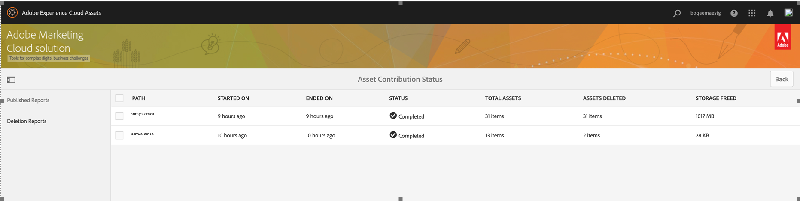
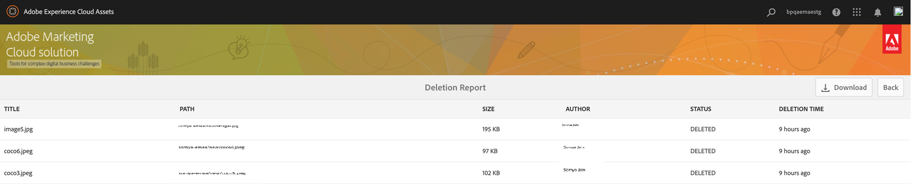

# Novedades de Experience Manager Assets Brand Portal {#what-s-new-in-aem-assets-brand-portal}

Adobe Experience Manager Assets Brand Portal le ayuda a adquirir, controlar y distribuir de forma segura recursos creativos aprobados a terceros externos y usuarios internos de la empresa a través de dispositivos. Ayuda a mejorar la eficacia del uso compartido de recursos, acelera el tiempo de comercialización de los recursos y reduce el riesgo de incumplimiento y acceso no autorizado. El Adobe está trabajando para mejorar la experiencia general de Brand Portal. Aquí tiene un vistazo a las nuevas funciones y mejoras.

## Qué cambió en 2023.10.0 {#what-changed-in-October-2023}

Brand Portal 2023.10.0 es una versión interna que incluye correcciones a problemas críticos. Ver más reciente [Notas de la versión de Brand Portal](brand-portal-release-notes.md).

## Qué cambió en la versión 2023.08.0 {#what-changed-in-August-2023}

Brand Portal 2023.08.0 es una versión interna que incluye correcciones a problemas críticos. Ver más reciente [Notas de la versión de Brand Portal](brand-portal-release-notes.md).

## Qué cambió en 2023.05.0 {#what-changed-in-May-2023}

Brand Portal 2023.05.0 es una versión interna que incluye correcciones a problemas críticos. Ver más reciente [Notas de la versión de Brand Portal](brand-portal-release-notes.md).

## Qué cambió en 2023.02.0 {#what-changed-in-February-2023}

Brand Portal 2023.02.0 es una versión interna que incluye correcciones a problemas críticos. Ver más reciente [Notas de la versión de Brand Portal](brand-portal-release-notes.md).

## Qué cambió en 2022.10.0 {#what-changed-in-October-2022}

Brand Portal 2022.10.0 es una versión interna que incluye correcciones a problemas críticos. Ver más reciente [Notas de la versión de Brand Portal](brand-portal-release-notes.md).

## Qué cambió en 2022.08.0 {#what-changed-in-August-2022}

Brand Portal 2022.08.0 es una versión interna que incluye correcciones a problemas críticos. Ver más reciente [Notas de la versión de Brand Portal](brand-portal-release-notes.md).

## Qué cambió en 2022.05.0 {#what-changed-in-May-2022}

Brand Portal ahora ejecuta trabajos automáticos cada doce horas para eliminar todos los recursos de Brand Portal que se publican en AEM. Como resultado, no es necesario eliminar manualmente los recursos de la carpeta Contribution para mantener el tamaño de la carpeta por debajo del límite de umbral. También puede controlar el estado de los trabajos de eliminación ejecutados automáticamente mediante el **[!UICONTROL Herramientas]** > **[!UICONTROL Estado de contribución de recursos]** > **[!UICONTROL Informes de eliminación]** en Brand Portal. El informe de un trabajo proporciona los siguientes detalles:

* Hora de inicio del trabajo
* Hora de finalización del trabajo
* Estado del trabajo
* Activos totales incluidos en un trabajo
* Activos totales eliminados correctamente en un trabajo
* Almacenamiento total disponible como resultado de la ejecución del trabajo

También puede profundizar más para ver los detalles de cada recurso incluido en un trabajo de eliminación. En el informe se incluyen detalles como el título del recurso, el tamaño, el autor, el estado de eliminación y el tiempo de eliminación.

Además, Brand Portal 2022.05.0 incluye correcciones a los problemas críticos. Ver más reciente [Notas de la versión de Brand Portal](brand-portal-release-notes.md).

## Qué cambió en 2022.02.0 {#what-changed-in-Feb-2022}

Brand Portal 2022.02.0 es una versión interna que incluye correcciones a problemas críticos. Ver más reciente [Notas de la versión de Brand Portal](brand-portal-release-notes.md).

## Qué cambió en 2021.10.0 {#what-changed-in-october-2021}

Brand Portal 2021.10.0 es una versión interna que incluye correcciones a problemas críticos. Ver más reciente [Notas de la versión de Brand Portal](brand-portal-release-notes.md).

## Qué cambió en 2021.08.0 {#what-changed-in-august-2021}

Brand Portal 2021.08.0 es una versión interna que presenta Perfiles de negocio para clientes empresariales y de equipos con el fin de proporcionar a las organizaciones un mejor control sobre sus recursos. Los usuarios ahora tienen derechos específicos de la organización sobre las organizaciones nuevas y migradas. Durante la migración, todas las cuentas de Adobe ID existentes se migran a ID empresariales.

* ID empresariales a todas las organizaciones nuevas y existentes una vez migradas.
* Los ID empresariales no requieren ninguna configuración específica, como reclamar un dominio o configurar un SSO.
* Puede agregar usuarios con cualquier dirección de correo electrónico, incluidos los dominios de correo electrónico públicos como gmail.com u outlook.com.

**Impacto en los usuarios de Brand Portal**

La migración no afecta al conjunto de datos, los recursos, los usuarios ni a ninguna configuración existentes. El único cambio interno que se produce durante la migración es la asignación de derechos de su organización existente a perfiles empresariales.

>[!NOTE]
>
>Actualmente, los perfiles de negocio son aplicables a las nuevas organizaciones que se crean después del 16 de agosto de 2021.
>
>Hasta que se migre su organización, puede seguir utilizando tipos de Adobe ID, Enterprise ID o Federated ID para acceder a la organización.

### Artículos de referencia {#reference-articles}

* [Introducción a perfiles de Adobe](https://helpx.adobe.com/enterprise/kb/introducing-adobe-profiles.html)

* [Administrar perfiles de Adobe](https://helpx.adobe.com/enterprise/using/manage-adobe-profiles.html)

* [Actualización de la experiencia de inicio de sesión para usuarios y administradores](https://helpx.adobe.com/enterprise/using/storage-for-business.html#new-admin-sign-in-exp)

* [Restricción de inicio de sesión durante la migración](https://helpx.adobe.com/enterprise/kb/account-temporarily-unavailable.html)

* [Administrar usuarios en Admin Console](https://helpx.adobe.com/enterprise/using/manage-users-individually.html)

* [Administración de perfiles de producto para usuarios empresariales](https://helpx.adobe.com/enterprise/using/manage-product-profiles.html#assign-users)

* [Confianza de dominio](https://helpx.adobe.com/enterprise/admin-guide.html/enterprise/using/set-up-identity.ug.html#directory-trusting)

<!--   
### Add new users to T2E organization   {#add-users-to-T2E-org}

On adding a new user in Admin Console for a new or migrated T2E organization, the user will have to perform an additional step **Join Team** to get entitled to the T2E organization. 

The user is entitled only if the user chooses to **Join Team**, otherwise the user won't get access to the selected T2E organization in Brand Portal. 

>[!NOTE]
>
>The workflow is not applicable to the existing Brand Portal users.

### Additional screen while navigating to Admin Console   {#navigate-to-admin-console}

The administrators will have to perform an additional step of selecting the T2E organization while navigating from Brand Portal to Admin Console. The workflow applies on the new and migrated T2E organizations.   

Selection of the T2E organization is a one-time activity and is not required everytime the administrator navigates from Brand Portal to Admin Console.

1. Log in to a T2E organization in Brand Portal as administrator.
1. Go to **[!UICONTROL Tools]** > **[!UICONTROL Users]** > **[!UICONTROL Management]** and click on the link **[!UICONTROL Launch Admin Console]**. 

   Or, go to **[!UICONTROL Unified Shell]** > **[!UICONTROL Administration]** and click on the link **[!UICONTROL Launch Admin Console]**. 
1. Search the T2E organization to login to Admin Console.

   

### Restriction during migration of an organization   {#login-restriction}

When an organization is undergoing T2E migration, the users of that organization will not be able to login to Brand Portal. The following error message appears on the screen. However, the migration won't impact the active user session until the token expires. 

Once the migration is complete, the users can login to Brand Portal. The users will receive an email notification containing the entitlement changes. If the users are entitled to more than one organization, they will have to select the organization at the time of login. 
-->

<!--
For a new or migrated T2E orgnization, the users will have an organization specific entitlement. A user can have multiple entitlements with the same email id for different T2E organizations. 
-->

## Qué cambió en la versión 2021.06.0 {#what-changed-in-june-2021}

Brand Portal 2021.06.0 es una versión interna que incluye correcciones a problemas críticos. Ver más reciente [Notas de la versión de Brand Portal](brand-portal-release-notes.md).

## Qué cambió en 2021.02.0 {#what-changed-in-feb-2021}

Brand Portal 2021.02.0 es una versión de mejora que incorpora el flujo de trabajo de activación de Brand Portal en AEM Assets as a Cloud Service, facilita la función de obtención de recursos en AEM Assets as a Cloud Service, mejora la experiencia de descarga de recursos e incluye correcciones críticas. También permite a los administradores configurar el comportamiento de descarga predeterminado de carpetas, colecciones y descarga masiva de recursos en el nivel de inquilino. El Brand Portal **[!UICONTROL Informe de uso]** también se ha modificado para reflejar los usuarios activos de Brand Portal.

### Activar Brand Portal en AEM Assets as a Cloud Service {#bp-automation-on-cloud-service}

AEM Assets as a Cloud Service tiene ahora derecho a tener una instancia preconfigurada de Brand Portal. El usuario de Cloud Manager puede activar Brand Portal en la instancia as a Cloud Service de AEM Assets.

Anteriormente, AEM Assets as a Cloud Service se configuraba manualmente con Brand Portal mediante la consola de Adobe Developer.

El usuario de Cloud Manager almacena en déclencheur el flujo de trabajo de activación que crea las configuraciones necesarias en el backend y activa Brand Portal en la misma organización de IMS que la instancia as a Cloud Service de AEM Assets.

Para activar Brand Portal en la instancia as a Cloud Service de AEM Assets:

1. Inicie sesión en Adobe Cloud Manager y navegue hasta **[!UICONTROL Entornos]**.
1. Seleccione los entornos (uno a uno) de la lista. Una vez que encuentre el entorno asociado a Brand Portal, haga clic en **[!UICONTROL Activar Brand Portal]** para iniciar el flujo de trabajo de activación.
1. Una vez activado el inquilino de Brand Portal, el estado cambia a Activado.

Consulte [activar Brand Portal en AEM Assets as a Cloud Service](https://experienceleague.adobe.com/docs/experience-manager-cloud-service/assets/brand-portal/configure-aem-assets-with-brand-portal.html).

### Abastecimiento de recursos en AEM Assets as a Cloud Service {#asset-sourcing-on-cloud-service}

La función de obtención de recursos ya está disponible en AEM Assets as a Cloud Service. La función está habilitada de forma predeterminada para todos los usuarios del servicio en la nube. Los usuarios de Brand Portal autorizados pueden contribuir al abastecimiento de recursos cargando nuevos recursos en las carpetas de contribución y publicando la carpeta de contribución de Brand Portal en la instancia as a Cloud Service de AEM Assets. Los administradores pueden revisar y aprobar la contribución de los usuarios de Brand Portal para distribuirla a otros usuarios de Brand Portal.

Anteriormente, el abastecimiento de recursos solo estaba disponible en AEM Assets (local y servicio administrado).

Consulte [Abastecimiento de recursos en Brand Portal](https://experienceleague.adobe.com/docs/experience-manager-brand-portal/using/asset-sourcing-in-brand-portal/brand-portal-asset-sourcing.html?lang=es).

### Descarga de recurso {#asset-download-setting}

Además de las **[!UICONTROL Configuración de descarga]**, los administradores de Brand Portal ahora pueden configurar el **[!UICONTROL Descarga de recursos]** configuración. Esta configuración permite a los administradores controlar el comportamiento de descarga predeterminado de carpetas, colecciones y descarga masiva de recursos (más de 20 recursos) en el nivel de inquilino.

<!--
Earlier, all the asset renditions were directly downloaded in a zip folder in case of folder, collection, and bulk download of assets. As the **[!UICONTROL Download]** dialog is skipped for folders or collections, there was no mechanism to control the downloading behaviour of the assets. Due to this, the users were finding it difficut to search for a particular asset rendition from a folder containing huge bunch of downloaded renditions. 
-->

Anteriormente, todas las representaciones de recursos se descargaban directamente en una carpeta zip. El **[!UICONTROL Descargar]** se omitió el cuadro de diálogo para carpetas y colecciones y no había ningún método para controlar el comportamiento de descarga de los recursos, lo que dificultaba la búsqueda de una representación en particular desde muchas descargas.

**[!UICONTROL Descarga de recursos]** la configuración ahora proporciona la opción de crear una carpeta independiente para cada recurso al descargar las carpetas, colecciones o descarga masiva de recursos.

Si la variable **[!UICONTROL Descarga de recursos]** Si la configuración está deshabilitada, las carpetas o colecciones se descargan en una carpeta zip que contiene todas las representaciones de recursos de la misma carpeta, excepto para descargar los recursos mediante el vínculo compartido.

Inicie sesión en su inquilino de Brand Portal como administrador y navegue hasta **[!UICONTROL Herramientas]** > **[!UICONTROL Descargar]**. Los administradores pueden activar la **[!UICONTROL Descarga de recursos]** configurar para crear una carpeta independiente para cada recurso al descargar carpetas, colecciones y descarga masiva de recursos.

Consulte [descarga de recursos de Brand Portal](https://experienceleague.adobe.com/docs/experience-manager-brand-portal/using/download/brand-portal-download-assets.html).
<!--
### Download using Share link {#download-using-share-link}

The default behavior of downloading the assets using share link is now independent of the **[!UICONTROL Download Settings]**. A separate folder is created for each asset while downloading the assets using share link. 
-->

### Informe de uso {#usage-report}

El Brand Portal **[!UICONTROL Informe de uso]** se ha modificado para reflejar únicamente los usuarios activos de Brand Portal. Los usuarios de Brand Portal que no están asignados a ningún perfil de producto en el Admin Console se consideran usuarios inactivos y no se reflejan en el **[!UICONTROL Informe de uso]**.

Anteriormente, en el Informe de uso se mostraban los usuarios activos e inactivos.

## Qué cambió en 2020.10.0 {#what-changed-in-oct-2020}

Brand Portal 2020.10.0 es una versión de mejora que se centra en simplificar la experiencia de descarga de recursos e incluye correcciones críticas. La mejora incluye un flujo de trabajo nuevo y mejorado para la descarga de recursos, opciones adicionales para excluir representaciones y descarga directa desde **[!UICONTROL Representaciones]** panel, configuración para permitir derechos de acceso y descarga para grupos específicos de usuarios, y fácil navegación a los archivos, colecciones y vínculos compartidos desde todas las páginas de Brand Portal. Ver más reciente [Notas de la versión de Brand Portal](brand-portal-release-notes.md).

### Experiencia de descarga simplificada {#download-dialog}

Antes, la variable **[!UICONTROL Descargar]** apareció un cuadro de diálogo con varias opciones, como crear una carpeta independiente para cada recurso, enviar por correo electrónico el recurso, seleccionar el recurso original, crear representaciones personalizadas, crear representaciones dinámicas, excluir representaciones del sistema y habilitar la aceleración de descargas, que eran ambiguas para los usuarios no técnicos o nuevos, especialmente cuando se seleccionaban varios recursos o carpetas para la descarga. Además, el usuario no podía ver todas las representaciones de recursos ni excluir una representación personalizada o dinámica específica.

El nuevo **[!UICONTROL Descargar]** Este cuadro de diálogo generaliza el proceso de selección y filtrado de recursos, lo que facilita a los usuarios de Brand Portal la toma de decisiones efectivas al descargar las representaciones de recursos. Enumera todos los recursos seleccionados y sus representaciones según el [**[!UICONTROL Descargar]**](brand-portal-download-assets.md) configuración y **[!UICONTROL Descargar]** configuración.

>[!NOTE]
>
>Ahora todos los usuarios tienen **[!UICONTROL Descarga rápida]** habilitado de forma predeterminada y requiere IBM Aspera Connect 3.9.9 (`https://www.ibm.com/docs/en/aspera-connect/3.9.9`) instalados en la extensión de su explorador antes de descargar los recursos desde Brand Portal.

<!--
If any of the **[!UICONTROL Custom Rendition]** or **[!UICONTROL System Rendition]** is enabled in the [**[!UICONTROL Download]**](brand-portal-download-assets.md) configuration and **[!UICONTROL Download]** settings are enabled for the group users, the new **[!UICONTROL Download]** dialog appears with all the renditions of the selected assets or folders containing assets in a list view. 
-->

Desde el **[!UICONTROL Descargar]** , los usuarios pueden:

* Vea todas las representaciones disponibles de cualquier recurso en la lista de descarga.
* Excluya las representaciones de los recursos que no sean necesarios para la descarga.
* Aplique el mismo conjunto de representaciones a todos los tipos de recursos similares con un solo clic.
* Aplicar diferentes conjuntos de representaciones para diferentes tipos de recursos.
* Crear una carpeta independiente para cada recurso.
* Descargar los recursos seleccionados y sus representaciones.

El flujo de trabajo de descarga permanece constante para los recursos independientes, varios recursos, las carpetas que contienen recursos, los recursos con o sin licencia y la descarga de recursos mediante un vínculo compartido. Consulte [pasos para descargar recursos de Brand Portal](https://experienceleague.adobe.com/docs/experience-manager-brand-portal/using/download/brand-portal-download-assets.html).

### Navegación rápida  {#quick-navigation}

Anteriormente, la opción para ver **[!UICONTROL Archivos]**, **[!UICONTROL Colecciones]**, y **[!UICONTROL Vínculos compartidos]** estaban ocultos y requerían varios clics cada vez que el usuario quería cambiar a otra vista.

En Brand Portal 2020.10.0, los usuarios pueden navegar a **[!UICONTROL Archivos]**, **[!UICONTROL Colecciones]**, y **[!UICONTROL Vínculos compartidos]** desde todas las páginas de Brand Portal con un solo clic mediante los vínculos de navegación rápida.

### Panel de representación mejorada {#rendition-panel}

Anteriormente, los usuarios solo podían ver el recurso original y sus representaciones en **[!UICONTROL Representaciones]** panel si alguna de las **[!UICONTROL Representación personalizada]** o **[!UICONTROL Representación del sistema]** se activó en la **[!UICONTROL Descargar]** configuración. Además, los usuarios tenían que descargar todas las representaciones de recursos, ya que no había ningún filtro para excluir representaciones personalizadas o dinámicas específicas que no fueran necesarias.

<!--
Earlier, if any of the custom or system renditions was enabled in the **[!UICONTROL Download]** settings, an additional **[!UICONTROL Download]** dialog appeared on clicking the **[!UICONTROL Download]** button wherein the user had to manually select the set of renditions (original asset, custom renditions, dynamic renditions) to download.
There was no filter to exclude specific custom or dynamic renditions which were not required for download.
-->

En Brand Portal 2020.10.0, los usuarios pueden excluir representaciones específicas y directamente [descargar las representaciones seleccionadas del panel Representaciones](brand-portal-download-assets.md#download-assets-from-asset-details-page) en la página de detalles del recurso sin tener que abrir el **[!UICONTROL Descargar]** diálogo.

<!-- 
In Brand Portal 2020.10.0, direct download and exclude renditions features are introduced in the **[!UICONTROL Renditions]** panel on the asset details page. All the renditions (original asset, custom renditions, dynamic renditions) under the rendition panel are now associated with a check box and are enabled by default. 

The user can clear the check boxes to exclude the renditions which are not required for download. And can click on the **[!UICONTROL Download]** button in the **[!UICONTROL Renditions]** panel to directly download the selected set of renditions in a zip folder without having to open the **[!UICONTROL Download]** dialog.
-->

### Configurar opciones de descarga {#download-permissions}

Además de las **[!UICONTROL Descargar]** En cuanto a las configuraciones, los administradores de Brand Portal también pueden configurar opciones para diferentes grupos de usuarios para ver y (o) descargar el recurso original y sus representaciones desde la página de detalles del recurso.

Inicie sesión en su inquilino de Brand Portal como administrador y navegue hasta **[!UICONTROL Herramientas]** > **[!UICONTROL Usuarios]**.

En el **[!UICONTROL Funciones del usuario]** , vaya a la página **[!UICONTROL Grupos]** para configurar las opciones de visualización y (o) descarga de los grupos de usuarios.

Anteriormente, la configuración solo estaba disponible para restringir el acceso de los usuarios del grupo a la descarga del recurso original.

El **[!UICONTROL Grupos]** de la pestaña **[!UICONTROL Funciones del usuario]** Esta página permite a los administradores configurar las opciones de visualización y descarga:

* Si ambos **[!UICONTROL Descargar original]** y **[!UICONTROL Descargar representaciones]** Si la configuración está activada, los usuarios del grupo seleccionado pueden ver y descargar los recursos originales y sus representaciones.
* Si ambas configuraciones están desactivadas, los usuarios solo podrán ver los recursos originales. Los usuarios no pueden ver las representaciones de recursos en la página de detalles de recursos.
* If only **[!UICONTROL Descargar original]** La configuración está activada, los usuarios solo pueden ver y descargar los recursos originales desde la página de detalles del recurso.
* If only **[!UICONTROL Descargar representaciones]** La configuración está activada, los usuarios pueden ver el recurso original, pero no pueden descargarlo. Sin embargo, el usuario puede ver y descargar las representaciones de recursos.

Consulte [configurar descarga de recursos](https://experienceleague.adobe.com/docs/experience-manager-brand-portal/using/download/brand-portal-download-assets.html#configure-download-permissions).

>[!NOTE]
>
>Si se agrega un usuario a varios grupos y si uno de esos grupos tiene restricciones, estas se aplican al usuario.

<!--
>Restrictions to access the original asset and their renditions do not apply to administrators even if they are members of restricted groups.
 >
 >The users can always download assets and their renditions from the repository using a `curl` request even if the download configurations are turned-off.
 >
-->

## Cambios en la versión 6.4.7 {#what-changed-in-647}

La versión 6.4.7 de Brand Portal incorpora el Visualizador de documentos, mejora la experiencia para descargar recursos e incluye correcciones críticas. Ver más reciente [Notas de la versión de Brand Portal](brand-portal-release-notes.md).

<!--
Brand Portal 6.4.7 release brings in the Document Viewer, leverages the Brand Portal administrators to configure asset download, and centers top customer requests. See latest [Brand Portal Release Notes](brand-portal-release-notes.md).
-->

### Visualizador de documentos {#doc-viewer}

El Visualizador de documentos mejora la experiencia de visualización del PDF. Proporciona una experiencia similar a la del Adobe Document Cloud al ver los archivos del PDF en Brand Portal.

Anteriormente, había opciones limitadas disponibles para ver los archivos del PDF.

Con el visualizador de documentos, los usuarios de Brand Portal ahora tienen las opciones de ver páginas, ver marcadores, buscar texto en la página, ampliar, reducir, navegar a páginas anteriores y siguientes, cambiar a página, ajustar a ventana, ajustar a pantalla y ocultar o mostrar la barra de herramientas.

>[!NOTE]
>
>La experiencia de visualización para otros formatos de documento permanece sin cambios.

### Experiencia de descarga {#download-configurations}

El proceso de descarga de recursos se ha reformado, lo que simplifica la experiencia del usuario a la vez que [descarga de recursos desde Brand Portal](brand-portal-download-assets.md).

El flujo de trabajo existente de descarga de recursos de Brand Portal va seguido inevitablemente de una  **[!UICONTROL Descargar]** diálogo con varias opciones de descarga para elegir.

En Brand Portal 6.4.7, los administradores de Brand Portal pueden configurar el recurso  **[!UICONTROL Descargar]** configuración. Las configuraciones disponibles son:

* **[!UICONTROL Descarga rápida]**
* **[!UICONTROL Representaciones personalizadas]**
* **[!UICONTROL Representaciones del sistema]**

El administrador de Brand Portal puede habilitar cualquier combinación para configurar la descarga de recursos.

<!--In Brand Portal 6.4.7, fast download, custom renditions, and system renditions are the three configurations available.-->

* Si ambos **[!UICONTROL Representaciones personalizadas]** y **[!UICONTROL Representaciones del sistema]** Las configuraciones están desactivadas, las representaciones originales de los recursos se descargan sin ningún cuadro de diálogo adicional que simplifique la experiencia de descarga para los usuarios de Brand Portal.

* Si alguna de las **[!UICONTROL Representación personalizada]** o **[!UICONTROL Representación del sistema]** está activada, la variable **[!UICONTROL Descargar]** aparece y se descarga el recurso original junto con las representaciones de recursos. Habilitando  **[!UICONTROL Descarga rápida]** La configuración de acelera el proceso de descarga.

En función de la configuración, el flujo de trabajo de descarga permanece constante para los recursos independientes, varios recursos, carpetas que contienen recursos, recursos con o sin licencia y descarga de recursos mediante un vínculo compartido.

## Cambios en la versión 6.4.6 {#what-changed-in-646}

En Brand Portal 6.4.6, se cambia el canal de autorización entre AEM Assets y Brand Portal. Brand Portal ahora es compatible con AEM Assets as a Cloud Service, AEM Assets 6.3 y versiones posteriores. En AEM Assets 6.3 y versiones posteriores, Brand Portal se configuraba anteriormente en la IU clásica a través de la puerta de enlace OAuth heredada, que utiliza el intercambio de tokens JWT para obtener un token de acceso IMS para la autorización. AEM Assets ahora se configura con Brand Portal a través de la consola de Adobe Developer, que obtiene un token IMS para la autorización del inquilino de Brand Portal.

<!-- The steps to configure integration are different depending on your AEM version, and whether you are configuring for the first-time, or upgrading the existing integration:
-->

<!--
  
   | **AEM Version** |**New Integration** |**Upgrade Integration** |
|---|---|---|
| **AEM 6.5** |[Create new integration](../using/brand-portal-configure-integration-65.md) |[Upgrade existing integration](../using/brand-portal-configure-integration-65.md#upgrade-integration-65) | 
| **AEM 6.4** |[Create new integration](../using/brand-portal-configure-integration-64.md) |[Upgrade existing integration](../using/brand-portal-configure-integration-64.md#upgrade-integration-64) | 
| **AEM 6.3** |[Create new integration](../using/brand-portal-configure-integration-63.md) |[Upgrade existing integration](../using/brand-portal-configure-integration-63.md#upgrade-integration-63) | 
| **AEM 6.2** | | 

   -->

Los pasos para configurar AEM Assets con Brand Portal AEM varían en función de la versión de la aplicación, y de si está configurando por primera vez o actualizando las configuraciones existentes:

<!--| **AEM Version** |**New Configuration** |**Upgrade Configuration** |
|---|---|---|
| **AEM 6.5 (6.5.4.0 and above)** |[Create configuration](../using/brand-portal-configure-integration-65.md) |[Upgrade configuration](../using/brand-portal-configure-integration-65.md#upgrade-integration-65) | 
| **AEM 6.4 (6.4.8.0 and above)** |[Create configuration](../using/brand-portal-configure-integration-64.md) |[Upgrade configuration](../using/brand-portal-configure-integration-64.md#upgrade-integration-64) | 
| **AEM 6.3 (6.3.3.8 and above)** |[Create configuration](../using/brand-portal-configure-integration-63.md) |[Upgrade configuration](../using/brand-portal-configure-integration-63.md#upgrade-integration-63) | 

-->

<!-- AEM Assets configuration with Brand Portal on Adobe I/O is supported on:
* AEM 6.5.4.0 and above
* AEM 6.4.8.0 and above
* AEM 6.3.3.8 and above -->

| **Versión de AEM** | **Nueva configuración** | **Actualizar configuración** |
|---|---|---|
| **AEM Assets as a Cloud Service** | [Crear configuración](https://experienceleague.adobe.com/docs/experience-manager-cloud-service/assets/brand-portal/configure-aem-assets-with-brand-portal.html) | - |
| **AEM.5 (6.5.4.0 y superior)** | [Crear configuración](https://experienceleague.adobe.com/docs/experience-manager-65/assets/brandportal/configure-aem-assets-with-brand-portal.html) | [Actualizar configuración](https://experienceleague.adobe.com/docs/experience-manager-65/assets/brandportal/configure-aem-assets-with-brand-portal.html#upgrade-integration-65) |

>[!NOTE]
>
>AEM Se recomienda actualizar la instancia de al Service Pack más reciente.

Ver más reciente [Notas de la versión de Brand Portal](brand-portal-release-notes.md).

Consulte [Preguntas frecuentes sobre Brand Portal](brand-portal-faqs.md).

## Cambios en la versión 6.4.5 {#what-changed-in-645}

Brand Portal 6.4.5 es una versión de funciones que se centra en proporcionar a los usuarios de Brand Portal (agencias/equipos externos) la capacidad de cargar contenido en Brand Portal y publicarlo en AEM Assets, sin la necesidad de acceder al entorno de creación. Esta función se denomina **[Abastecimiento de recursos en Brand Portal](brand-portal-asset-sourcing.md)** y mejora las experiencias de los clientes al proporcionar un mecanismo bidireccional para que los usuarios contribuyan y compartan recursos con otros usuarios de Brand Portal distribuidos globalmente.

### Abastecimiento de recursos en Brand Portal {#asset-sourcing-in-bp}

AEM La fuente de recursos permite a los usuarios de la (administradores/usuarios no administradores) crear carpetas con un **Contribución de recursos** , asegurando que la nueva carpeta creada y abierta al envío de recursos por los usuarios de Brand Portal. Almacena automáticamente en déclencheur un flujo de trabajo que crea dos subcarpetas adicionales, denominadas NEW y SHARED, dentro de la carpeta recién creada **Contribución** carpeta.

AEM A continuación, el usuario define el requisito cargando una breve descripción de los tipos de recursos que se deben añadir a la carpeta Contribution y cargando los recursos de línea de base en **COMPARTIDO** para garantizar que los usuarios de Brand Portal tengan la información de referencia que necesitan. El administrador puede otorgar a los usuarios activos de Brand Portal acceso a la carpeta de contribución antes de publicar el recién creado **Contribución** a Brand Portal.

Una vez que el usuario haya terminado de agregar contenido en la **NUEVO** AEM , pueden volver a publicar la carpeta de contribución en el entorno de creación de la. Tenga en cuenta que puede tardar unos minutos en completar la importación y reflejar el contenido recién publicado en AEM Assets.

Además, todas las funcionalidades existentes permanecen sin cambios. Los usuarios de Brand Portal pueden ver, buscar y descargar recursos desde la carpeta de contribuciones y desde otras carpetas permitidas. Además, los administradores pueden compartir la carpeta de contribución, modificar las propiedades y añadir recursos a las colecciones.

>[!NOTE]
>
>La fuente de recursos en Brand Portal AEM es compatible con la versión 6.5.2.0 y posteriores de la.
>
>AEM AEM Esta función no es compatible con las versiones anteriores (las versiones 6.3 y 6.4), de la que se ha hecho referencia en la versión 6.3 de la.

### Cargar recursos a la carpeta de contribuciones {#upload-assets-in-bp}

Los usuarios de Brand Portal con los permisos adecuados pueden cargar recursos o carpetas individuales (archivo .zip) que contengan varios recursos en la carpeta de contribución. Un usuario puede cargar varios recursos en una carpeta de contribución de recursos. Sin embargo, solo se puede crear una carpeta a la vez.

Los usuarios de Brand Portal solo pueden cargar recursos en **NUEVO** subcarpeta. El **COMPARTIDO** está diseñada para la distribución de requisitos y recursos de línea de base.

### Publicar carpeta de contribución en AEM Assets {#publish-assets-to-aem}

Una vez completada la carga en **NUEVO** , los usuarios de Brand Portal AEM pueden volver a publicar la carpeta de contribución en la carpeta de. La importación y el reflejo del contenido o los recursos publicados en AEM Assets pueden tardar unos minutos en completarse. Consulte [publicar carpeta de contribución en AEM Assets](brand-portal-publish-contribution-folder-to-aem-assets.md).

## Cambios en la versión 6.4.4 {#what-changed-in-644}

La versión 6.4.4 de Brand Portal se centra en las mejoras en la búsqueda de texto y en las solicitudes de los clientes principales. Ver más reciente [Notas de la versión de Brand Portal](brand-portal-release-notes.md).

### Mejoras de búsqueda

Brand Portal 6.4.4 y versiones posteriores admiten la búsqueda de texto parcial en el predicado de propiedad en el panel de filtrado. Para permitir la búsqueda de texto parcial, debe habilitar **Búsqueda parcial** en Predicado de propiedad, en el formulario de búsqueda.

Siga leyendo para obtener más información sobre la búsqueda de texto parcial y la búsqueda con comodines.

#### Búsqueda parcial de frases {#partial-phrase-search}

Ahora puede buscar recursos especificando solo una parte (es decir, una palabra o dos) de la frase buscada en el panel de filtrado.

**Caso de uso**
La búsqueda parcial de frases resulta útil cuando no está seguro de la combinación exacta de palabras que se producen en la frase buscada.

Por ejemplo, si el formulario de búsqueda en Brand Portal utiliza el predicado de propiedades para la búsqueda parcial del título de los recursos, especificando el término **acampar** devuelve todos los recursos con la palabra camp en su frase de título.

#### Búsqueda con comodines {#wildcard-search}

La Brand Portal permite el uso del asterisco (&#42;) en la consulta de búsqueda junto con una parte de la palabra en la frase buscada.

**Caso de uso. Si no está seguro de las palabras exactas que aparecen en la frase buscada, puede utilizar una búsqueda con comodines para rellenar los huecos en la consulta de búsqueda.

Por ejemplo, si especifica **escalar&#42;** devuelve todos los recursos que tienen palabras que comienzan por los caracteres **escalar** en la frase del título si el formulario de búsqueda en Brand Portal utiliza el predicado de propiedad para la búsqueda parcial del título de recursos.

Del mismo modo, se especifica:

* **&#42;escalar** devuelve todos los recursos con palabras que terminan con caracteres **escalar** en su frase de título.

* **&#42;escalar&#42;** devuelve todos los recursos que tienen palabras que comprenden los caracteres **escalar** en su frase de título.

>[!NOTE]
>
>Al seleccionar **Búsqueda parcial** casilla, **Ignorar mayúsculas y minúsculas** está seleccionado de forma predeterminada.

## Cambios en la versión 6.4.3 {#what-changed-in}

La versión 6.4.3 de Brand Portal se centra en: proporciona a las organizaciones un alias alternativo además de su ID de inquilino en la URL de acceso de Brand Portal AEM, la nueva configuración de la jerarquía de carpetas, las mejoras de compatibilidad con vídeo, la publicación programada desde la instancia de autor de a Brand Portal, las mejoras operativas y atiende a las solicitudes de los clientes.

### Navegación de jerarquía de carpetas para no administradores

Los administradores ahora pueden configurar cómo se muestran las carpetas a los usuarios no administradores (editores, visualizadores y usuarios invitados) al iniciar sesión. [Habilitar la jerarquía de carpetas](../using/brand-portal-general-configuration.md) La configuración de se agrega en **Configuración general**, en el panel herramientas de administración. Si la configuración es:

* **activado** Sin embargo, el árbol de carpetas que comienza desde la carpeta raíz es visible para los usuarios que no son administradores. De este modo, se les concede una experiencia de navegación similar a la de los administradores.
* **inhabilitado**, solo se muestran las carpetas compartidas en la página de aterrizaje.

El [Habilitar la jerarquía de carpetas](../using/brand-portal-general-configuration.md) (cuando está activada) le ayuda a diferenciar las carpetas con los mismos nombres compartidos desde diferentes jerarquías. Al iniciar sesión, los usuarios no administradores ahora ven las carpetas principales virtuales (y antecesoras) de las carpetas compartidas.

Las carpetas compartidas están organizadas dentro de los respectivos directorios en carpetas virtuales. Puede reconocer estas carpetas virtuales con un icono de candado.

La miniatura predeterminada de las carpetas virtuales es la imagen en miniatura de la primera carpeta compartida.

### Buscar en una ruta o jerarquía de carpetas específica

**Navegador de rutas** El predicado se introduce en el formulario de búsqueda para permitir la búsqueda de recursos en un directorio específico. La ruta de búsqueda predeterminada del predicado de búsqueda para el explorador de rutas es `/content/dam/mac/<tenant-id>/`, que se puede configurar editando el formulario de búsqueda predeterminado.

* Los usuarios administradores pueden utilizar el Explorador de rutas para desplazarse a cualquier directorio de carpetas de Brand Portal.
* Los usuarios no administradores pueden utilizar el Explorador de rutas para navegar únicamente a las carpetas compartidas con ellos (y volver a las carpetas principales).

  Por ejemplo, `/content/dam/mac/<tenant-id>/folderA/folderB/folderC` se comparte con un usuario no administrador. El usuario puede buscar recursos dentro de folderC mediante el Explorador de rutas. Este usuario también puede navegar a la carpeta B y a la carpeta A (ya que son antecesoras de la carpeta C que se comparte con el usuario).

Ahora puede restringir la búsqueda de recursos dentro de una carpeta específica a la que ha navegado, en lugar de comenzar en la carpeta raíz.

La búsqueda en estas carpetas devuelve solo los resultados de los recursos que se han compartido con el usuario.

### Compatibilidad con representaciones de vídeo de Dynamic Media

AEM Los usuarios cuya instancia de autor de la esté en el modo híbrido de Dynamic Media pueden obtener una vista previa de las representaciones de medios dinámicos y descargarlas, además de los archivos de vídeo originales.

Para permitir la previsualización y descarga de representaciones de medios dinámicos en cuentas de inquilino específicas, los administradores deben especificar **Configuración de Dynamic Media** (URL del servicio de vídeo (URL de puerta de enlace DM) e ID de registro para recuperar el vídeo dinámico) en **Vídeo** configuración del panel de herramientas de administración.

Puede obtener una vista previa de los vídeos de Dynamic Media en:

* Página de detalles del recurso
* Vista de tarjeta del recurso
* Página de vista previa de vínculos compartidos

Las codificaciones de vídeo de Dynamic Media se pueden descargar desde:

* Brand Portal
* Vínculo compartido

### Publicación programada en Brand Portal

AEM El flujo de trabajo de publicación de recursos (y carpetas) desde la instancia de autor de la versión 6.4.2.0 de la a Brand Portal se puede programar para una fecha y hora posteriores.

Del mismo modo, los recursos publicados se pueden eliminar del portal más adelante, programando la cancelación de publicación del flujo de trabajo de Brand Portal.

### Alias de inquilino configurable en la URL

Las organizaciones pueden personalizar la dirección URL de su portal si tienen un prefijo alternativo en la dirección URL. Para obtener un alias para el nombre del inquilino en la URL de su portal existente, las organizaciones deben ponerse en contacto con Atención al cliente.

Solo se puede personalizar el prefijo de la dirección URL de Brand Portal, y no la dirección URL completa.\
Por ejemplo, una organización con un dominio existente **geomettrix.brand-portal.adobe.com** puede obtener **geomettrixinc.brand-portal.adobe.com** creado a petición.

AEM Sin embargo, la instancia de autor de puede ser [configurado](https://experienceleague.adobe.com/docs/experience-manager-65/assets/brandportal/configure-aem-assets-with-brand-portal.html) solo con la URL del id de inquilino y no con la URL del alias de inquilino (alternativa).

Las organizaciones pueden satisfacer sus necesidades de promoción de la marca personalizando la dirección URL del portal, en lugar de atenerse a la dirección URL proporcionada por el Adobe.

### Descargar mejoras de experiencia

La versión ofrece una experiencia de descarga simplificada con un número reducido de clics y advertencias, sobre:

* Opción para descargar solo las representaciones (y no los recursos originales).
* Descargar los recursos cuando el acceso a las representaciones originales está restringido.

## Cambios en la versión 6.4.2 {#what-changed-in-1}

La versión 6.4.2 de Brand Portal incorpora una serie de funciones para abordar las necesidades de distribución de recursos de las organizaciones y ayudarlas a llegar a muchos usuarios distribuidos globalmente mediante el acceso de los invitados y una experiencia óptima con descargas aceleradas. Brand Portal también proporciona un mayor control a las organizaciones a través de nuevas configuraciones para los administradores, los informes recién añadidos y las soluciones a las solicitudes de los clientes.

### Acceso de invitado

AEM El portal de marca permite a los invitados acceder al portal. Un usuario invitado no necesita credenciales para entrar al portal y puede acceder y descargar todas las carpetas y colecciones públicas. Los usuarios invitados pueden agregar recursos a su lightbox (colección privada) y descargarlos. También pueden ver la búsqueda de etiquetas inteligentes y los predicados de búsqueda establecidos por los administradores. La sesión de invitado no permite a los usuarios crear colecciones y búsquedas guardadas, ni compartirlas más, acceder a la configuración de carpetas y colecciones y compartir recursos como vínculos.

En una organización, se permiten varias sesiones de invitados simultáneas, lo que está limitado al 10 % de la cuota total de usuarios por organización.

Una sesión de invitado permanece activa durante dos horas. Por lo tanto, el estado de Lightbox también se conserva hasta dos horas después de la hora de inicio de la sesión. Después de dos horas, la sesión de invitado debe reiniciarse, por lo que se pierde el estado de Lightbox.

### Descargas aceleradas

Los usuarios de Brand Portal pueden aplicar descargas rápidas basadas en IBM Aspera Connect para obtener velocidades hasta 25 veces más rápidas y disfrutar de una experiencia de descarga perfecta, independientemente de su ubicación en todo el mundo. Para descargar los recursos más rápido desde Brand Portal o el vínculo compartido, los usuarios deben seleccionar **Habilitar la aceleración de descarga** en el cuadro de diálogo de descarga, siempre que la aceleración de descarga esté habilitada en su organización.

Para habilitar la descarga acelerada basada en IBM Aspera para la organización, los administradores de **Habilitar la aceleración de descarga** (que está desactivada de forma predeterminada) desde [Configuración general](brand-portal-general-configuration.md#allow-download-acceleration) en el panel herramientas administrativas. Para obtener más información sobre los requisitos previos y los pasos de solución de problemas para descargar archivos de recursos más rápido desde Brand Portal y vínculos compartidos, consulte [Guía para acelerar las descargas desde Brand Portal](../using/accelerated-download.md#main-pars-header).

### Informe de inicios de sesión de usuario

Se ha introducido un nuevo informe, para rastrear los inicios de sesión de los usuarios. El **Inicios de sesión de usuario** Este informe puede ser fundamental para permitir que las organizaciones auditen y controlen a los administradores delegados y a otros usuarios de Brand Portal.

Los registros de informes muestran nombres, ID de correo electrónico, personas (administrador, visor, editor, invitado), grupos, último inicio de sesión, estado de actividad y recuento de inicios de sesión de cada usuario desde la implementación de Brand Portal 6.4.2 hasta el momento de la generación del informe. Los administradores pueden exportar el informe como .csv. Junto con otros informes, el informe Inicios de sesión de usuarios permite a las organizaciones supervisar más de cerca las interacciones de los usuarios con los recursos de marca aprobados, lo que garantiza la conformidad con las oficinas de cumplimiento corporativo.

### Acceso a las representaciones originales

Los administradores pueden restringir el acceso del usuario a los archivos de imagen originales (.jpeg, .tiff, .png, .bmp, .gif, .pjpeg, x-portable-anymap, x-portable-bitmap, x-portable-graymap, x-portable-pixmap, x-rgb, x-xbitmap, x-xpixmap, x-icon, image/photoshop, image/x-photoshop, .psd, image/vnd.adobe.photoshop) y dar acceso a las representaciones de baja resolución que descargan desde Brand Portal o un vínculo compartido. Este acceso se puede controlar en el nivel de grupo de usuarios desde la pestaña Grupos de la página Funciones de usuario en el panel Herramientas de administración.

* De forma predeterminada, todos los usuarios pueden descargar las representaciones originales, ya que el acceso al original está habilitado para todos.
* Los administradores deben desmarcar las casillas de verificación correspondientes para evitar que un grupo de usuarios acceda a las representaciones originales.
* Si un usuario es miembro de varios grupos, pero solo uno de los grupos tiene restricciones, estas se aplican a ese usuario.
* Las restricciones no se aplican a los administradores, aunque pertenezcan a grupos restringidos.
* Los permisos del usuario que comparte recursos como vínculo se aplican a los usuarios que descargan recursos mediante vínculos compartidos.

### Ruta de jerarquía de carpetas en las vistas Tarjeta y Lista

Las tarjetas de carpetas, en la Vista de tarjetas, ahora muestran información de jerarquía de carpetas a usuarios no administradores (editor, visor y usuario invitado). Esta funcionalidad permite a los usuarios conocer la ubicación de las carpetas a las que acceden con respecto a la jerarquía principal.

La información de jerarquía de carpetas es especialmente útil para diferenciar las carpetas que tienen nombres similares a otras carpetas compartidas desde una jerarquía de carpetas diferente. Si los usuarios no administradores no son conscientes de la estructura de carpetas de los recursos compartidos con ellos, los recursos o carpetas con nombres similares parecen confusos.

* Las rutas mostradas en las respectivas tarjetas se truncan para ajustarse a los tamaños de tarjeta. Sin embargo, los usuarios pueden ver la ruta completa como información del objeto al pasar el ratón por encima de la ruta truncada.

La vista de lista muestra la ruta de carpeta de los recursos en una columna para todos los usuarios de Brand Portal.

### Opción Información general para ver las propiedades del recurso

Brand Portal proporciona la opción Información general a los usuarios no administradores (editores, visualizadores, usuarios invitados) para ver las propiedades de los recursos o carpetas seleccionados. La opción Información general está visible:

1. En la barra de herramientas de la parte superior, al seleccionar un recurso o una carpeta.
2. En la lista desplegable, seleccione el Selector de carril.

Al seleccionar la opción Información general mientras hay un recurso o una carpeta seleccionados, los usuarios pueden ver el título, la ruta y la hora de creación del recurso. Por su parte, en la página de detalles del recurso, al seleccionar la opción Información general, los usuarios pueden ver los metadatos del recurso.

## Nuevas configuraciones

Se agregan seis nuevas configuraciones para que los administradores habiliten o deshabiliten las siguientes funcionalidades en inquilinos específicos:

* Permitir el acceso de invitados
* Permitir que los usuarios soliciten acceso a Brand Portal
* Permitir que los administradores eliminen recursos de Brand Portal
* Permitir la creación de colecciones públicas
* Permitir la creación de colecciones públicas inteligentes
* Permitir la aceleración de descarga

Las configuraciones anteriores están disponibles en Acceso y Configuración general en el panel de herramientas administrativas.

### IU de Adobe I/O para configurar integraciones de autenticación

Brand Portal 6.4.2 y versiones posteriores utilizan el OAuth heredado (`https://legacy-oauth.cloud.adobe.io/`) para crear la aplicación JWT, que permite configurar integraciones de autenticación para permitir la integración de AEM Assets con Brand Portal. Anteriormente, la interfaz de usuario para configurar integraciones de OAuth estaba alojada en `https://marketing.adobe.com/developer/`. Para obtener más información sobre la integración de AEM Assets con Brand Portal para publicar recursos y colecciones en Brand Portal, consulte [Configuración de la integración de AEM Assets con Brand Portal](https://experienceleague.adobe.com/docs/experience-manager-65/assets/brandportal/configure-aem-assets-with-brand-portal.html).

## Mejoras de búsqueda

Los administradores pueden hacer que los predicados de propiedad no distingan entre mayúsculas y minúsculas mediante el predicado de propiedad actualizado, que tiene una comprobación para Omitir mayúsculas y minúsculas. Esta opción está disponible para predicado de propiedades y predicado de propiedades de varios valores.\
Sin embargo, la búsqueda sin distinción entre mayúsculas y minúsculas es comparativamente más lenta que la búsqueda predeterminada para el predicado de propiedades. Si hay demasiados predicados que no distinguen entre mayúsculas y minúsculas en el filtro de búsqueda, la búsqueda puede ralentizarse. Por lo tanto, se recomienda utilizar la búsqueda sin distinción entre mayúsculas y minúsculas con prudencia.

## Cambios en 6.4.1 {#what-changed-in-2}

Brand Portal 6.4.1 es una versión de actualización de plataforma que incluye varias funciones nuevas y mejoras fundamentales, como exploraciones, búsquedas y mejoras de rendimiento, para ofrecer experiencias de cliente satisfactorias.

### Mejoras de exploración

* Nuevo carril del árbol de contenido para navegar rápidamente por una jerarquía de recursos.

* Se han introducido nuevos métodos abreviados de teclado, por ejemplo _(p)_ para navegar a la página de propiedades, _(e)_ para Editar, y _(ctrl+c)_ para operaciones de copia.
* Se ha mejorado el desplazamiento, la experiencia de carga diferida en la vista de tarjetas y listas para explorar un gran número de recursos.
* Vista de tarjeta mejorada con compatibilidad con tarjetas de diferentes tamaños según la configuración de vista.

* La vista de tarjeta ahora muestra la marca de fecha y hora al pasar el ratón por encima de la etiqueta de fecha.

* Vista de columna mejorada con **Más detalles** en la instantánea del recurso, lo que le permite desplazarse a la página de detalles de un recurso.

* La vista de lista ahora muestra de forma predeterminada los nombres de archivo de los recursos de la primera columna, además de la información de configuración regional, tipo de recurso, dimensiones, tamaño, clasificación y publicación. Nuevo **Configuración de vista** se puede utilizar para configurar la cantidad de detalle que se mostrará en la vista de lista.

* Se ha mejorado la experiencia de detalles de recursos con la capacidad de navegar hacia atrás y adelante entre recursos mediante nuevos botones de navegación y ver el recuento de recursos.

* AEM Nueva capacidad para previsualizar archivos de audio, cargados desde la página de detalles del recurso, en la página de recursos de.
* Nueva capacidad Recursos relacionados proporcionada en Propiedades del recurso. AEM Los recursos relacionados con otros recursos de origen o derivados en Brand Portal y publicados en ahora tienen su relación intacta en Brand Portal, con vínculos a los recursos relacionados en la página de propiedades.
* Se ha introducido una nueva configuración para restringir la creación de colecciones públicas a usuarios no administradores. Las organizaciones pueden trabajar con el equipo de Atención al cliente para configurar esta capacidad en cuentas específicas.

### Mejoras de búsqueda

* Capacidad introducida para volver a la misma posición en los resultados de búsqueda, después de navegar a un elemento de búsqueda, sin volver a ejecutar la consulta de búsqueda.
* Nuevo recuento de resultados de búsqueda para mostrar el número de resultados de búsqueda que se han proporcionado.
* Se ha mejorado el filtro de búsqueda de tipo de archivo con la capacidad de filtrar los resultados de búsqueda en función de tipos MIME específicos como .jpg, .png y .psd en comparación con imágenes, documentos y opciones multimedia anteriores.
* Filtros de búsqueda mejorados para colecciones, con marcas de tiempo precisas en lugar de la funcionalidad del deslizador de tiempo anterior.
* Se han introducido nuevos filtros de tipo Acceso para buscar las colecciones que son Públicas o no Públicas.

### Optimizaciones de descarga

* Un solo archivo grande se descarga directamente, sin la creación del archivo zip, lo que mejora la velocidad y el rendimiento.
* El límite de descarga por tamaño de archivo para la función de uso compartido de vínculos es **1** GB.

* Los usuarios ahora pueden elegir descargar únicamente los archivos personalizados y originales, así como evitar representaciones integradas, mientras descargan recursos desde Brand Portal o a través de la función de vínculos compartidos.

### Mejoras de rendimiento

* Mejora de hasta el 100 % en la velocidad de descarga de recursos.
* Mejora de hasta el 40 % en la respuesta de búsqueda de recursos.
* Mejora de hasta un 40% en el rendimiento de navegación.

**Nota**: Las mejoras citadas se ajustan a las pruebas realizadas en el laboratorio.

### Funcionalidades mejoradas de creación de informes

**Informe de vínculos compartidos introducido**
Se ha introducido un nuevo informe, para proporcionar información sobre los vínculos compartidos. El informe Compartir vínculos enumera todas las direcciones URL de los recursos compartidos con usuarios internos y externos de la organización en el lapso de tiempo especificado. También informa de cuándo se compartió el vínculo, quién lo compartió y cuándo caduca.

**Se ha modificado el punto de entrada para acceder al informe de uso**
Los informes de uso ahora se consolidan con otros informes y ahora se pueden ver desde la consola Informes de recursos. Para llegar a la consola Informes de recursos, vaya a **Crear/administrar informes** en el panel herramientas administrativas.

**Experiencia del usuario mejorada con los informes**
La interfaz de creación de informes en Brand Portal se ha vuelto más intuitiva y proporciona un mayor control a las organizaciones. Además de crear varios informes, los administradores ahora pueden volver a visitar los informes generados y descargarlos o eliminarlos, ya que estos informes se guardan en Brand Portal.

Cada uno de los informes que se están creando se puede personalizar añadiendo o eliminando columnas predeterminadas. Además, se pueden añadir columnas personalizadas a los informes Descargar, Caducidad y Publicar para controlar su grado de granularidad.

### Herramientas de administración mejoradas

Se ha mejorado el selector de propiedades en las herramientas de administración para metadatos, búsquedas e informes con capacidad de escritura anticipada y exploración para simplificar la experiencia de administración.

### Otras mejoras

* Ahora, los recursos publicados en Brand Portal AEM a partir de las versiones 6.3.2.1 y 6.4 se pueden poner a disposición de los usuarios generales de Brand Portal marcando la casilla Publicar carpeta pública en el cuadro de diálogo Replicación de AEM Assets Brand Portal.

* Los administradores reciben una notificación a través de los correos electrónicos de solicitud de acceso, excepto en el área de notificaciones de Brand Portal, si alguien ha solicitado acceso a Brand Portal.

## Cambios en la versión 6.3.2 {#what-changed-in-3}

Brand Portal 6.3.2 incluye funciones nuevas y mejoradas orientadas a las principales solicitudes de los clientes y a las mejoras generales de rendimiento.

### Solicitud de acceso a Brand Portal {#request-access-to-brand-portal}

Los usuarios ahora pueden solicitar acceso a Brand Portal utilizando el nuevo **necesita acceso** disponible en la pantalla de inicio de sesión de Brand Portal.

Dependiendo de si los usuarios tienen un Adobe ID o necesitan crear un Adobe ID, pueden seguir el flujo de trabajo adecuado para enviar una solicitud. Los administradores de productos de Brand Portal reciben estas solicitudes en su área de notificación y conceden acceso a través de Adobe Admin Console.

Para obtener más información, consulte [Solicitud de acceso a Brand Portal](../using/brand-portal.md#requestaccesstobrandportal).

### Mejora en el informe de recursos descargados {#enhancement-in-the-assets-downloaded-report}

El informe de recursos descargados ahora incluye el recuento de descargas de recursos por usuario dentro del intervalo de fecha y hora especificado. Los usuarios pueden descargar este informe en formato .csv y compilar datos como el recuento total de descargas de un recurso con licencia.

Para obtener más información, consulte los pasos 3 y 6 de [Creación y administración de informes adicionales](../using/brand-portal-reports.md#createandmanageadditionalreports).

### Notificación de mantenimiento de Brand Portal {#brand-portal-maintenance-notification}

Brand Portal ahora muestra un banner de notificación unos días antes de una próxima actividad de mantenimiento. Una notificación de ejemplo:

Para obtener más información, consulte [Notificación de mantenimiento de Brand Portal](https://experienceleague.adobe.com/docs/experience-manager-brand-portal/using/introduction/brand-portal.html).

### Mejora de los recursos con licencia compartidos mediante la función de uso compartido de vínculos {#enhancement-for-licensed-assets-shared-using-the-link-share-feature}

Al descargar recursos con licencia mediante la función de uso compartido de vínculos, ahora se le pedirá que acepte el acuerdo de licencia para esos recursos.

Para obtener más información, consulte el paso 12 de [Uso compartido de recursos como vínculo](../using/brand-portal-link-share.md#shareassetsasalink).

### Mejora del selector de usuarios {#user-picker-enhancement}

El rendimiento del selector de usuarios ahora se ha mejorado para satisfacer las necesidades de los clientes con una gran base de usuarios.

### Cambios de marca en Experience Cloud {#experience-cloud-branding-changes}

Brand Portal ahora se ajusta a la nueva marca de Adobe Experience Cloud.

## Cambios en la versión 6.3.1 {#what-changed-in-4}

Brand Portal 6.3.1 incluye funciones nuevas y mejoradas orientadas a alinear Brand Portal AEM con los SDK de los SDKs de la manera más adecuada para su uso en el mercado de trabajo de la.

### Interfaz de usuario actualizada {#upgraded-user-interface}

Para alinear la experiencia del usuario de Brand Portal AEM con la de los usuarios, el Adobe está realizando una transición a la interfaz de usuario de Coral 3. Este cambio mejora la capacidad de uso general, incluida la navegación y la apariencia.

#### Experiencia de navegación mejorada {#enhanced-navigational-experience}

* Acceso rápido a las herramientas administrativas a través del nuevo logotipo del Adobe:

* Navegación de productos mediante una superposición:

* Navegación rápida a las carpetas principales:

* Búsqueda y navegación rápidas al contenido y las herramientas necesarios:

### Experiencia de navegación mejorada {#enhanced-browsing-experience}

* Nueva vista de columna para examinar las carpetas anidadas:

 

* En la lista de recursos de una carpeta, el recurso más reciente cargado aparece en la parte superior.

### Experiencia de búsqueda mejorada {#enhanced-search-experience}

* La nueva función de búsqueda Omni facilita el acceso rápido al contenido, la capacidad o las etiquetas relevantes mediante sugerencias automáticas a medida que escribe las palabras clave de búsqueda. La búsqueda Omni está disponible en todas las funciones de búsqueda.

* También puede añadir filtros de búsqueda a la búsqueda de Omni para reducir aún más y acelerar la búsqueda.

* La nueva búsqueda basada en la clasificación de recursos le permite buscar recursos con clasificación, si se publican desde AEM Assets.
* La nueva función de búsqueda de varios valores acepta varias palabras clave con el operador AND para descubrir los recursos más rápido.
* La nueva capacidad de ampliación de la búsqueda permite mejorar la relevancia de la búsqueda para que los recursos específicos aparezcan en la parte superior de los resultados.
* La nueva función de búsqueda basada en rutas permite proporcionar la ruta a una carpeta anidada para poder buscar recursos en esa carpeta.

#### Nueva búsqueda basada en etiquetas inteligentes {#new-smart-tags-based-search}

Si las imágenes con etiquetas inteligentes se publican desde AEM Assets a Brand Portal, puede buscar estas imágenes en Brand Portal utilizando los nombres de las etiquetas inteligentes como palabras clave de búsqueda. Esta función solo está disponible para archivos.

### Experiencia de descarga mejorada {#enhanced-downloading-experience}

Después de descargar una carpeta anidada, puede conservar la jerarquía de carpetas original. Los recursos dentro de una carpeta anidada se pueden descargar en una sola carpeta, en lugar de en carpetas independientes.

### Rendimiento mejorado {#improved-performance}

Las mejoras en las funciones de exploración, búsqueda y descarga mejoran significativamente el rendimiento de Brand Portal.

### Nueva administración de derechos digitales para recursos {#new-digital-rights-management-for-assets}

Los administradores pueden establecer la fecha y hora de caducidad de los recursos antes de compartirlos. Una vez que caduca un recurso, es visible para los visualizadores y editores, pero no se puede descargar. Cuando caduca un recurso, los administradores reciben una notificación.

### Clasificación de recursos mejorada {#enhanced-asset-sorting}

La ordenación de recursos en una carpeta en la vista de listas ya no se restringe al número de recursos que se muestran en la primera página. Todos los recursos de una carpeta se ordenan, independientemente de si todos se muestran en la primera página.

### Informes mejorados {#reporting-capabilities}

Los administradores pueden crear y administrar tres tipos de informes: recursos descargados, caducados y publicados. También está disponible la posibilidad de configurar las columnas de un informe y exportar los informes al formato CSV.

### Metadatos adicionales {#additional-metadata}

Brand Portal 6.3.1 introduce metadatos adicionales, que están a la par con AEM Assets 6.3. Puede utilizar el formulario Editor de esquemas para controlar los metadatos que deben estar visibles en la página Propiedades de recursos. Los metadatos de los recursos no son visibles para los usuarios de recursos compartidos de vínculos externos, que solo pueden obtener una vista previa y descargar recursos mediante la dirección URL de recursos compartidos de vínculos.

### Funciones adicionales para administradores {#additional-capabilities-for-administrators}

* Antes de finalizar las personalizaciones del fondo de pantalla de inicio de sesión, los administradores pueden obtener una vista previa de los cambios.

* Cuando un administrador añade nuevos usuarios, no es necesario que acepten invitaciones para añadirlos a Brand Portal, sino que se añaden automáticamente.

### Nuevas funciones de publicación en AEM Assets 6.3 {#new-publishing-capabilities-in-aem-assets}

* AEM Los administradores de pueden publicar el esquema de metadatos de AEM Assets en Brand Portal AEM mediante 6.3 SP 1-CFP 1 (6.3.1.1), que estará disponible en el cuarto trimestre de 2017.

* AEM Los administradores de pueden publicar todas las etiquetas de AEM Assets en Brand Portal AEM AEM utilizando el SP1-CFP7 de la versión 6.2 y el SP 1-CFP1 de la versión 6.3 (6.3.1.1) de la versión 6.2.

* Desde AEM Assets, puede publicar recursos y colecciones que tengan etiquetas, incluidas etiquetas inteligentes. A continuación, puede buscar estos recursos o colecciones utilizando estas etiquetas como palabras clave de búsqueda en Brand Portal.
