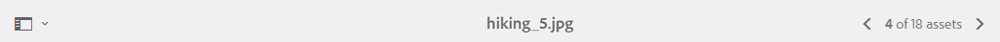
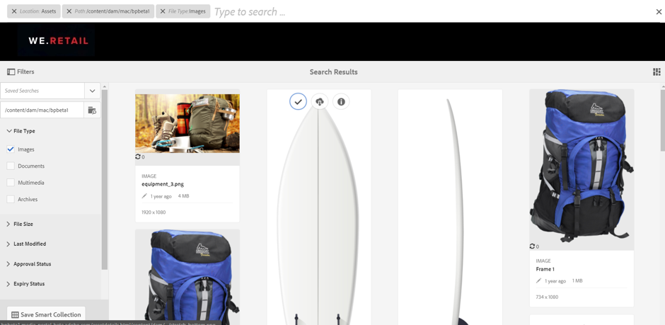

# Novedades de AEM Assets Brand Portal {#what-s-new-in-aem-assets-brand-portal}

Recursos Adobe Experience Manager (AEM) Assets Brand Portal le ayuda a adquirir, controlar y distribuir de forma segura recursos creativos aprobados a terceros externos y usuarios empresariales internos entre dispositivos. Ayuda a mejorar la eficiencia del uso compartido de activos, acelera el tiempo de comercialización de los activos y reduce el riesgo de incumplimiento y acceso no autorizado. Adobe está trabajando para mejorar la experiencia general de Brand Portal. A continuación, podrá echar un vistazo a las nuevas funciones y mejoras.

## Qué cambió en 6.4.4 {#what-is-changing-in}

La versión 6.4.4 de Brand Portal se centra en las mejoras en la búsqueda de texto y en las principales solicitudes de los clientes. Consulte las últimas notas de la versión [de Brand Portal](brand-portal-release-notes.md).

### Mejoras de búsqueda {#search-enhancements}

A partir de la versión 6.4.4, Brand Portal admite la búsqueda de texto parcial en el predicado de propiedades en el panel de filtrado. Para permitir la búsqueda de texto parcial, debe habilitar la búsqueda **parcial** en el predicado de propiedades en el formulario de búsqueda.

Continúe leyendo para obtener más información sobre la búsqueda de texto parcial y la búsqueda con comodines.

#### Búsqueda de frase parcial {#partial-phrase-search}

Ahora puede buscar recursos especificando solo una parte (es decir, una palabra o dos) de la frase buscada en el panel de filtrado.

**Caso** de uso La búsqueda parcial de frases resulta útil cuando no está seguro de la combinación exacta de palabras que se producen en la frase buscada.

Por ejemplo, si el formulario de búsqueda en Brand Portal utiliza Property Predicate para la búsqueda parcial del título de los recursos, al especificar el término **camp** se devuelven todos los recursos con la palabra camp en su frase de título.

#### Búsqueda de comodines {#wildcard-search}

El portal de marca permite utilizar el asterisco (*) en la consulta de búsqueda junto con una parte de la palabra de la frase buscada.

**Caso** de uso Si no está seguro de las palabras exactas que se producen en la frase buscada, puede utilizar una búsqueda comodín para llenar los huecos en la consulta de búsqueda.

Por ejemplo, si se especifica **escalar*** , se devuelven todos los recursos con palabras que comienzan con los caracteres **escalar** en la frase de título si el formulario de búsqueda en Brand Portal utiliza Predicado de propiedades para la búsqueda parcial del título de los recursos.

Del mismo modo, especificando:

* ***escalar** devuelve todos los recursos que tienen palabras que finalizan con caracteres **escalados** en la frase de título.

* ***escalar*** devuelve todos los recursos que tienen palabras que comprenden los caracteres que **suben** en la frase de título.

>[!NOTE]
>
>Al seleccionar la casilla de verificación Búsqueda **** parcial, se selecciona **Omitir caso** de forma predeterminada.

## Qué cambió en 6.4.3 {#what-changed-in}

La versión de Brand Portal 6.4.3 se centra en: proporcionar a las organizaciones un alias alternativo además de su ID de inquilino en la URL de acceso a Brand Portal, nueva configuración de jerarquía de carpetas, mejoras en la compatibilidad con vídeo, publicación programada de la instancia de AEM Author en Brand Portal, mejoras operativas — y atiende las solicitudes de los clientes.

### Navegación de jerarquía de carpetas para usuarios que no son administradores

Los administradores ahora pueden configurar cómo se muestran las carpetas a los usuarios no administradores (editores, visores y usuarios invitados) al iniciar sesión. [Habilitar la configuración de jerarquía](../using/brand-portal-general-configuration.md) de carpetas se agrega en Configuración **** general, en el panel Herramientas de administración. Si la configuración es:

* **activado**, el árbol de carpetas que comienza desde la carpeta raíz es visible para los usuarios no administradores. Por lo tanto, concederles una experiencia de navegación similar a la de los administradores.
* **está desactivada**, solo se muestran las carpetas compartidas en la página de aterrizaje.

**El caso de uso**

La funcionalidad [Habilitar jerarquía](../using/brand-portal-general-configuration.md) de carpetas (cuando está habilitada) ayuda a diferenciar las carpetas con los mismos nombres compartidos de jerarquías diferentes. Al iniciar sesión, los usuarios que no son administradores ahora ven las carpetas principales virtuales (y antecesoras) de las carpetas compartidas.
 

Las carpetas compartidas están organizadas dentro de los directorios respectivos en carpetas virtuales. Puede reconocer estas carpetas virtuales con un icono de candado.

Tenga en cuenta que la miniatura predeterminada de las carpetas virtuales es la imagen en miniatura de la primera carpeta compartida.

### Buscar en una ruta o jerarquía de carpetas específica

**El predicado del explorador** de rutas se introduce en el formulario de búsqueda para permitir la búsqueda de recursos en un directorio específico. La ruta de búsqueda predeterminada del predicado de búsqueda para el Explorador de rutas es */content/dam/mac/&lt;identificación del inquilino&gt;/*, que se puede configurar editando el formulario de búsqueda predeterminado.

* Los usuarios administradores pueden utilizar el navegador de rutas para desplazarse a cualquier directorio de carpetas de Brand Portal.
* Los usuarios que no son administradores pueden utilizar el navegador de rutas para desplazarse únicamente a las carpetas (y volver a las carpetas principales) compartidas con ellos.
Por ejemplo, */content/dam/mac/&lt;inquilino-id&gt;/folderA/folderB/folderC* se comparte con un usuario no administrador. El usuario puede buscar recursos dentro de folderC mediante el navegador de rutas. Este usuario también puede desplazarse a la carpeta B y a la carpeta A (ya que son antecesores de la carpeta C que se comparte con el usuario).

**Caso de uso**

Ahora puede restringir la búsqueda de recursos dentro de una carpeta específica a la que ha navegado, en lugar de comenzar en la carpeta raíz.

Tenga en cuenta que la búsqueda en estas carpetas solo se obtiene a partir de los recursos que se han compartido con el usuario.

### Compatibilidad con representaciones de vídeo de Dynamic Media

Los usuarios cuya instancia de AEM Author se encuentra en el modo híbrido Dynamic Media pueden obtener una vista previa y descargar las representaciones de medios dinámicos, además de los archivos de vídeo originales.

Para permitir la vista previa y descarga de representaciones de medios dinámicos en cuentas de inquilino específicas, los administradores deben especificar la configuración de **Dynamic Media** (URL del servicio de vídeo (URL de DM-Gateway) y el ID de registro para recuperar el vídeo dinámico) en la configuración de **vídeo** desde el panel Herramientas de administración.

**Caso** de uso Los vídeos de Dynamic Media se pueden previsualizar en:

* Página de detalles del recurso
* Vista de tarjeta del recurso
* Página de vista previa de uso compartido de vínculos

Los códigos de vídeo de Dynamic Media se pueden descargar de:

* Portal de marca
* Vínculo compartido

### Publicación programada en Brand Portal

Recursos (y carpetas): el flujo de trabajo de publicación de [AEM (6.4.2.0)](https://helpx.adobe.com/experience-manager/6-4/release-notes/sp-release-notes.html#main-pars_header_9658011) La instancia de creación en Brand Portal se puede programar para una fecha y hora posteriores.

Del mismo modo, los recursos publicados se pueden eliminar del portal en una fecha (hora) posterior, programando el flujo de trabajo Cancelar publicación desde Brand Portal.

### Alias de inquilino configurable en URL

Las organizaciones pueden personalizar la dirección URL del portal si tienen un prefijo alternativo en la dirección URL. Para obtener un alias para el nombre del inquilino en la URL del portal existente, las organizaciones deben ponerse en contacto con el servicio de asistencia de Adobe.

Tenga en cuenta que solo se puede personalizar el prefijo de la dirección URL de Brand Portal y no toda la dirección URL.\
Por ejemplo, una organización con un dominio existente **geometSymmetrix.brand-portal.adobe.com** puede obtener **geomettrixinc.brand-portal.adobe.com** creada a petición.

Sin embargo, la instancia de AEM Author solo se puede [configurar](https://helpx.adobe.com/experience-manager/6-5/assets/using/brand-portal-configuring-integration.html) con la dirección URL de identificación del inquilino y no con la URL de alias del inquilino (alternativa).

**Caso** de uso Las organizaciones pueden satisfacer sus necesidades de marca personalizando la dirección URL del portal, en lugar de atenerse a la dirección URL proporcionada por Adobe.

### Mejoras de la experiencia de descarga

La versión ofrece una experiencia de descarga simplificada con un número reducido de clics y advertencias, en:

* optar por descargar solo las representaciones (y no los recursos originales).
* descargar los recursos cuando se restringe el acceso a las representaciones originales.

## Qué cambió en 6.4.2 {#what-changed-in-1}

La versión 6.4.2 de Brand Portal ofrece una amplia gama de funciones para satisfacer las necesidades de distribución de recursos de las organizaciones y ayudarles a llegar a un gran número de usuarios distribuidos globalmente mediante el acceso de los invitados y una experiencia óptima con las descargas aceleradas. Brand Portal también proporciona un mayor control a las organizaciones a través de nuevas configuraciones para administradores, informes recién agregados y atendiendo las solicitudes de los clientes.

### Acceso de invitados

El portal de AEM Brand permite a los invitados acceder al portal. Un usuario invitado no necesita credenciales para entrar en el portal y puede acceder y descargar todas las carpetas y colecciones públicas. Los usuarios invitados pueden añadir recursos a su caja de iluminación (colección privada) y descargar los mismos recursos. También pueden ver los predicados de búsqueda y búsqueda de etiquetas inteligentes establecidos por los administradores. La sesión de invitado no permite a los usuarios crear colecciones y búsquedas guardadas ni compartirlas más, acceder a la configuración de carpetas y colecciones y compartir recursos como vínculos.

En una organización, se permiten varias sesiones de invitados simultáneas, lo que se limita al 10 % de la cuota total de usuarios por organización.

Una sesión de invitado permanece activa durante dos horas. Por lo tanto, el estado de la caja de luz también se conserva hasta dos horas después de la hora de inicio de la sesión. Después de dos horas, la sesión de invitado debe reiniciarse, por lo que se pierde el estado de la caja de luz.

### Descargas aceleradas

Los usuarios de Brand Portal pueden aprovechar las rápidas descargas basadas en IBM Aspera Connect para obtener velocidades hasta 25 veces más rápidas y disfrutar de una experiencia de descarga sin problemas, independientemente de su ubicación en todo el mundo. Para descargar los recursos más rápidamente desde Brand Portal o el vínculo compartido, los usuarios deben seleccionar la opción **Activar aceleración** de descarga en el cuadro de diálogo de descarga, siempre que la aceleración de la descarga esté habilitada en su organización.

Para habilitar la descarga acelerada basada en IBM Aspera para la organización, los administradores pueden activar la opción **Activar aceleración** de descarga (que está deshabilitada de forma predeterminada) desde Configuración  general en el panel Herramientas administrativas. Para obtener más información sobre los requisitos previos y los pasos de solución de problemas para descargar archivos de recursos más rápidamente desde Brand Portal y vínculos compartidos, consulte [Guía para acelerar las descargas desde Brand Portal](../using/accelerated-download.md#main-pars-header).

### Informe de inicios de sesión de usuario

Se ha introducido un nuevo informe para rastrear los inicios de sesión de los usuarios. El informe **de inicios de sesión** de usuario puede ser fundamental para permitir que las organizaciones auditen y verifiquen a los administradores delegados y otros usuarios de Brand Portal.

Los registros de informes muestran los nombres, los ID de correo electrónico, las personas (administrador, visor, editor, invitado), los grupos, el último inicio de sesión, el estado de la actividad y el recuento de inicio de sesión de cada usuario desde la implementación de Brand Portal 6.4.2 hasta el momento de la generación de informes. Los administradores pueden exportar el informe como .csv. Junto con otros informes, el informe de inicios de sesión de usuario permite a las organizaciones monitorear más de cerca las interacciones de los usuarios con los recursos de marca aprobados, asegurando así el cumplimiento de las normas por parte de las oficinas de cumplimiento corporativo.

### Acceso a las representaciones originales

Los administradores pueden restringir el acceso del usuario a los archivos de imagen originales (.jpeg, .tiff, .png, .bmp, .gif, .pjpeg, x-portable-anymap, x-portable-bitmap, x-portable-graymap, x-portable-pixmap, x-rgb, x-xbitmap, x-xxmap, x-icon, image/photoshop, image/x-photoshop, .x-photoshop psd, image/vnd.adobe.photoshop) y dar acceso a representaciones de baja resolución que descargan desde Brand Portal o vínculo compartido. Este acceso se puede controlar a nivel de grupo de usuarios desde la ficha Grupos de la página Funciones de usuario del panel Herramientas de administración.

* De forma predeterminada, todos los usuarios pueden descargar las representaciones originales, ya que el acceso al original está habilitado para todos.
* Los administradores deben anular la selección de las casillas de verificación correspondientes para evitar que un grupo de usuarios acceda a las representaciones originales.
* Si un usuario es miembro de varios grupos pero sólo uno de ellos tiene restricciones, las restricciones se aplican a ese usuario.
* Las restricciones no se aplican a los administradores, aunque sean miembros de grupos restringidos.
* Los permisos del usuario que comparte recursos como vínculo se aplican a los usuarios que descargan recursos mediante vínculos compartidos.

### Ruta de jerarquía de carpetas en las vistas de tarjeta y lista

Las tarjetas de carpetas, en la vista de tarjeta, ahora muestran información sobre la jerarquía de carpetas a usuarios no administradores (Editor, Visor y Usuario invitado). Esta funcionalidad permite a los usuarios conocer la ubicación de las carpetas a las que acceden, con respecto a la jerarquía principal.

La información sobre la jerarquía de carpetas resulta especialmente útil para diferenciar las carpetas que tienen nombres similares a otras carpetas compartidas desde una jerarquía de carpetas diferente. Si los usuarios no administradores no conocen la estructura de carpetas de los recursos compartidos con ellos, los recursos o carpetas con nombres similares parecen confusos.

* Las rutas que se muestran en las tarjetas respectivas se truncan para adaptarse a los tamaños de las tarjetas. Sin embargo, los usuarios pueden ver la ruta completa como información del objeto al pasar el ratón sobre la ruta truncada.

La vista de lista muestra la ruta de carpeta de los recursos en una columna para todos los usuarios de Brand Portal.

### Opción Información general para ver las propiedades de los recursos

Brand Portal proporciona la opción Información general a los usuarios no administradores (editores, visores, usuarios invitados) para ver las propiedades de los recursos de los recursos o carpetas seleccionados. La opción Información general está visible:

1. En la barra de herramientas de la parte superior, seleccione un recurso o una carpeta.
2. En la lista desplegable al seleccionar el Selector de raíl.

Al seleccionar la opción Información general mientras se selecciona un recurso o carpeta, los usuarios pueden ver el título, la ruta y la hora de creación de recursos. Mientras que, en la página de detalles del recurso, si selecciona la opción Información general, los usuarios podrán ver los metadatos del recurso.

## Nuevas configuraciones

Se añaden seis nuevas configuraciones para que los administradores habiliten o deshabiliten las siguientes funcionalidades en inquilinos específicos:

* Permitir el acceso de invitados
* Permitir que los usuarios soliciten acceso a Brand Portal
* Permitir que los administradores eliminen recursos de Brand Portal
* Permitir la creación de colecciones públicas
* Permitir la creación de colecciones inteligentes públicas
* Permitir aceleración de descarga

Las configuraciones anteriores están disponibles en Acceso y Configuración general en el panel Herramientas administrativas.

### La interfaz de usuario de los hosts de Adobe.io permite configurar integraciones de autenticación

A partir de la versión 6.4.2 de Brand Portal, se utiliza la [https://legacy-oauth.cloud.adobe.io/](https://legacy-oauth.cloud.adobe.io/) de Adobe.io para crear una aplicación JWT, que permite configurar integraciones de autenticación para permitir la integración de AEM Assets con Brand Portal. Anteriormente, la interfaz de usuario para configurar integraciones de OAuth estaba alojada en [https://marketing.adobe.com/developer/](https://marketing.adobe.com/developer/). Para obtener más información sobre la integración de Recursos AEM con Brand Portal para la publicación de recursos y colecciones en Brand Portal, consulte [Configuración de la integración de Recursos AEM con Brand Portal](https://helpx.adobe.com/in/experience-manager/6-4/assets/using/brand-portal-configuring-integration.html).

## Mejoras de búsqueda

Los administradores pueden hacer que los predicados de propiedades no distingan entre mayúsculas y minúsculas mediante el predicado de propiedades actualizado, que tiene una comprobación para ignorar mayúsculas y minúsculas. Esta opción está disponible para predicado de propiedades y predicado de propiedades de varios valores.\
Sin embargo, la búsqueda que no distingue entre mayúsculas y minúsculas es comparativamente más lenta que la búsqueda predeterminada del predicado de propiedades. Si hay demasiados predicados que no distinguen entre mayúsculas y minúsculas en el filtro de búsqueda, la búsqueda puede ralentizarse. Por lo tanto, se recomienda utilizar la búsqueda sin distinción entre mayúsculas y minúsculas con prudencia.

## Qué cambió en 6.4.1 {#what-changed-in-2}

Brand Portal 6.4.1 es una versión de actualización de plataforma que incorpora varias funciones nuevas y mejoras fundamentales, como la exploración, la búsqueda y el rendimiento, para ofrecer una experiencia satisfactoria al cliente.

### Mejoras de exploración

* Nuevo carril del árbol de contenido para navegar rápidamente por una jerarquía de recursos.

* Se han introducido nuevos métodos abreviados de teclado, por ejemplo _(p)_ para la navegación a la página de propiedades, _(e)_ para Editar y _(ctrl+c)_ para las operaciones de copia.
* Se ha mejorado el desplazamiento y la experiencia de carga diferida en la vista de tarjeta y lista para explorar un gran número de recursos.
* Vista de tarjeta mejorada compatible con tarjetas de distintos tamaños según la configuración de visualización.

* La vista de tarjeta ahora muestra la marca de fecha y hora al pasar el ratón por encima de la etiqueta de fecha.

* Se mejoró la vista de columnas con **Más detalles** en la instantánea de recursos, lo que le permite desplazarse a la página de detalles de un recurso.

* La vista de lista ahora muestra los nombres de archivo de los recursos en la primera columna de forma predeterminada, además de la configuración regional, el tipo de recurso, las dimensiones, el tamaño, la clasificación y la información de publicación. Se puede utilizar la nueva configuración **de** vista para configurar la cantidad de detalles que se mostrarán en la vista de lista.

* Se ha mejorado la experiencia de detalle de recursos con la capacidad de desplazarse hacia atrás y adelante entre recursos mediante los nuevos botones de navegación y ver el recuento de recursos.

* Nueva capacidad para previsualizar archivos de audio, cargados desde AEM, en la página de detalles del recurso.
* Nueva capacidad Recursos relacionados proporcionada en las propiedades de los recursos. Los recursos relacionados con otros recursos de origen o derivados en AEM y publicados en Brand Portal ahora tienen su relación intacta en Brand Portal, con vínculos a los recursos relacionados en la página de propiedades.
* Se ha introducido una nueva configuración para restringir la creación de colecciones públicas a los usuarios que no son administradores. Las organizaciones pueden trabajar con el equipo de asistencia de Adobe para configurar esta capacidad en cuentas específicas.

### Mejoras de búsqueda

* Capacidad introducida para volver a la misma posición en los resultados de búsqueda, después de navegar a un elemento de búsqueda, sin volver a ejecutar la consulta de búsqueda.
* Se ha proporcionado un nuevo recuento de resultados de búsqueda para mostrar el número de resultados de búsqueda.
* Se mejoró el filtro de búsqueda de tipo de archivo con la capacidad de filtrar los resultados de búsqueda en función de tipos MIME detallados, como .jpg, .png y .psd, en comparación con las opciones anteriores de Imágenes, Documentos y Multimedia.
* Filtros de búsqueda mejorados para colecciones, con marcas de hora precisas en lugar de la funcionalidad del deslizador de tiempo anterior.
* Se han introducido nuevos filtros de tipo Acceso para buscar las colecciones que son públicas o no.

### Optimizaciones de descarga

* Se descarga directamente un solo archivo grande, sin necesidad de crear un archivo zip, lo que mejora la velocidad y el rendimiento.
* El límite de descargas postales para la función de uso compartido de vínculos ha aumentado a 5 GB, desde 1 GB.

* Ahora los usuarios pueden optar por descargar únicamente los archivos personalizados y originales, y evitar las representaciones integradas, mientras descargan recursos desde Brand Portal o a través de la función de vínculos compartidos.

### Mejoras de rendimiento

* Mejora de hasta un 100% en la velocidad de descarga de recursos.
* Mejora de hasta un 40% en la respuesta de búsqueda de recursos.
* Mejora de hasta un 40 % en el rendimiento de navegación.

**Nota**: Las mejoras citadas son las pruebas realizadas en el laboratorio.

### Capacidades de informes mejoradas

**Informe** de uso compartido de vínculos introducido Se ha introducido un nuevo informe para proporcionar información sobre los vínculos compartidos. El informe Uso compartido de vínculos enumera todas las direcciones URL, a los recursos, compartidas con usuarios internos y externos de la organización en el intervalo de tiempo especificado. También indica cuándo se compartió el vínculo, quién lo compartió y cuándo caduca.

**Se modificó el punto de entrada para acceder Informe** de uso El informe de uso ahora se consolida con otros informes y ahora se puede ver desde la consola Informes de recursos. Para acceder a la consola Informes de recursos, vaya al panel **Crear/Administrar informes** desde el panel Herramientas administrativas.

**La experiencia mejorada del usuario con la interfaz de creación de informes** en Brand Portal se ha vuelto más intuitiva y le ofrece un mayor control. Además de crear varios informes, los administradores ahora pueden volver a examinar los informes generados y descargarlos o eliminarlos, ya que estos informes se guardan en Brand Portal.

Cada uno de los informes que se crean se puede personalizar agregando o eliminando columnas predeterminadas. Además, se pueden agregar columnas personalizadas a los informes Descargar, Caducidad y Publicar para controlar su grado de granularidad.

### Herramientas de administración mejoradas

Se mejoró el selector de propiedades en las herramientas de administración para metadatos, búsqueda e informes con la capacidad de exploración y escritura anticipada para simplificar la experiencia de administración.

### Otras mejoras

* Los recursos publicados en Brand Portal desde AEM 6.3.2.1 y 6.4 ahora pueden ponerse a disposición del público para los usuarios generales de Brand Portal marcando la casilla de verificación Publicación de carpetas públicas en el cuadro de diálogo Replicación de Brand Portal de AEM Assets.

* Los administradores reciben notificaciones por correo electrónico de solicitud de acceso, aparte de las notificaciones del área de notificación de Brand Portal, si alguien ha solicitado acceso a Brand Portal.

## Qué cambió en 6.3.2 {#what-changed-in-3}

Brand Portal 6.3.2 incluye una funcionalidad nueva y mejorada orientada a las principales solicitudes de los clientes y mejoras generales de rendimiento.

### Solicitar acceso a Brand Portal {#request-access-to-brand-portal}

Ahora los usuarios pueden solicitar acceso a Brand Portal mediante la nueva función de acceso****** disponible en la pantalla de inicio de sesión de Brand Portal.

Según si los usuarios tienen un Adobe ID o necesitan crearlo, pueden seguir el flujo de trabajo adecuado para enviar una solicitud. Los administradores de productos de Brand Portal reciben dichas solicitudes en el área de notificación y conceden acceso a través de Adobe Admin Console.

Para obtener más información, consulte [Solicitud de acceso a Brand Portal](../using/brand-portal.md#requestaccesstobrandportal).

### Mejora en el informe de recursos descargados {#enhancement-in-the-assets-downloaded-report}

El informe de recursos descargados ahora incluye el recuento de descargas de recursos por usuario dentro del intervalo de fecha y hora especificado. Los usuarios pueden descargar este informe en formato .csv y compilar datos como el recuento total de descargas de un recurso con licencia.

Para obtener más información, consulte los pasos 3 y 6 en [Crear y administrar informes](../using/brand-portal-reports.md#createandmanageadditionalreports)adicionales.

### Notificación de mantenimiento de Brand Portal {#brand-portal-maintenance-notification}

Brand Portal ahora muestra una pancarta de notificación unos días antes de una próxima actividad de mantenimiento. Una notificación de muestra:

Para obtener más información, consulte la notificación de mantenimiento de Brand Portal.

### Mejora de los recursos con licencia compartidos mediante la función de compartir vínculos {#enhancement-for-licensed-assets-shared-using-the-link-share-feature}

Al descargar recursos con licencia mediante la función de uso compartido de vínculos, ahora se le solicita que acepte el contrato de licencia para dichos recursos.

Para obtener más información, consulte el paso 12 en [Compartir recursos como vínculo](../using/brand-portal-link-share.md#shareassetsasalink).

### Mejora del selector de usuarios {#user-picker-enhancement}

El rendimiento del selector de usuarios ahora se mejora para satisfacer las necesidades de los clientes con una gran base de usuarios.

### Cambios en la marca de Experience Cloud {#experience-cloud-branding-changes}

Brand Portal ahora se ajusta a la nueva marca de Adobe Experience Cloud.

## Qué cambió en 6.3.1 {#what-changed-in-4}

Brand Portal 6.3.1 incluye funciones nuevas y mejoradas orientadas a alinear Brand Portal con AEM.

### Interfaz de usuario actualizada {#upgraded-user-interface}

Para alinear la experiencia de usuario de Brand Portal con AEM, Adobe está realizando la transición a la interfaz de usuario de Coral 3. Este cambio mejora el uso general, incluida la navegación, y el aspecto.

#### Experiencia de navegación mejorada {#enhanced-navigational-experience}

* Acceso rápido a las herramientas administrativas a través del nuevo logotipo de Adobe:

* Navegación del producto a través de una superposición:

* Navegación rápida a carpetas principales:

* Búsqueda y navegación rápidas al contenido y las herramientas necesarios:

### Experiencia de navegación mejorada {#enhanced-browsing-experience}

* Nueva vista de columna para explorar las carpetas anidadas:

 

* En la lista de recursos de una carpeta, el último recurso cargado aparece en la parte superior.

### Experiencia de búsqueda mejorada {#enhanced-search-experience}

* La nueva función de búsqueda Omni facilita el acceso rápido al contenido, la capacidad o las etiquetas relevantes a través de sugerencias automáticas a medida que escribe las palabras clave de búsqueda. La búsqueda Omni está disponible en todas las funciones de búsqueda.

* También puede agregar filtros de búsqueda a la búsqueda de Omni para reducir aún más la búsqueda y agilizarla.

* La nueva búsqueda basada en la clasificación de recursos le permite buscar recursos con clasificaciones, si se publican desde Recursos AEM.
* La nueva función de búsqueda de varios valores acepta varias palabras clave con el operador Y para descubrir los recursos más rápido.
* La nueva capacidad de ampliación de búsqueda le permite mejorar la relevancia de la búsqueda para que los recursos específicos aparezcan en la parte superior de los resultados de búsqueda.
* La nueva función de búsqueda basada en rutas le permite proporcionar la ruta a una carpeta anidada para poder buscar recursos en esa carpeta.

#### Nueva búsqueda basada en etiquetas inteligentes {#new-smart-tags-based-search}

Si las imágenes con etiquetas inteligentes se publican desde Recursos AEM a Brand Portal, puede buscar estas imágenes en Brand Portal utilizando los nombres de etiquetas inteligentes como palabras clave de búsqueda. Esta función solo está disponible para archivos.

### Experiencia de descarga mejorada {#enhanced-downloading-experience}

Después de descargar una carpeta anidada, puede conservar la jerarquía de carpetas original. Los recursos dentro de una carpeta anidada se pueden descargar en una sola carpeta, en lugar de carpetas independientes.

### Rendimiento mejorado {#improved-performance}

Las mejoras en las funciones de exploración, búsqueda y descarga mejoran significativamente el rendimiento de Brand Portal.

### Nueva administración de derechos digitales para activos {#new-digital-rights-management-for-assets}

Los administradores pueden definir la fecha y hora de caducidad de los recursos antes de compartirlos. Una vez que un recurso caduca, es visible para los visores y editores, pero no se puede descargar. Cuando un recurso caduca, los administradores reciben una notificación.

### Clasificación de recursos mejorada {#enhanced-asset-sorting}

La ordenación de recursos en una carpeta en la vista de lista ya no está restringida al número de recursos que se muestran en la primera página. Todos los recursos de una carpeta se ordenan, independientemente de si todos aparecen en la primera página.

### Informes mejorados {#reporting-capabilities}

Los administradores pueden crear y administrar tres tipos de informes: recursos descargados, caducados y publicados. También está disponible la posibilidad de configurar las columnas de un informe y exportar los informes a formato CSV.

### Metadatos adicionales {#additional-metadata}

Brand Portal 6.3.1 introduce metadatos adicionales, que están a la par con AEM Assets 6.3. Puede utilizar el formulario Editor de esquemas para controlar los metadatos que deben estar visibles en la página Propiedades de recursos. Los metadatos del recurso no son visibles para los usuarios de recursos compartidos de vínculos externos, que solo pueden obtener una vista previa y descargar recursos mediante la URL de uso compartido de vínculos.

### Funciones adicionales para administradores {#additional-capabilities-for-administrators}

* Antes de finalizar las personalizaciones del fondo de pantalla de inicio de sesión, los administradores pueden obtener una vista previa de los cambios.

* Una vez que un administrador agrega nuevos usuarios, no necesita aceptar invitaciones para agregarlos a Brand Portal, se agregan automáticamente.

### Nuevas funciones de publicación en AEM Assets 6.3 {#new-publishing-capabilities-in-aem-assets}

* Los administradores de AEM pueden publicar esquemas de metadatos de Recursos AEM en Brand Portal con AEM 6.3 SP 1-CFP 1 (6.3.1.1), que estará disponible en el cuarto trimestre de 2017.

* Los administradores de AEM pueden publicar todas las etiquetas de Recursos AEM en Brand Portal con AEM 6.2 SP1-CFP7 y AEM 6.3 SP 1-CFP 1 (6.3.1.1).

* Desde Recursos AEM, puede publicar recursos y colecciones que tengan etiquetas, incluidas etiquetas inteligentes. A continuación, puede buscar estos recursos o colecciones utilizando estas etiquetas como palabras clave de búsqueda en Brand Portal.

## Frequently asked questions {#frequently-asked-questions}

**Qus. ¿Perderé el acceso a los recursos, funciones o configuraciones existentes que haya creado?**
**Ans.** Todas las funciones y configuraciones existentes permanecen intactas. Los usuarios finales no se ven afectados y el contenido permanece intacto.

**Ques. ¿Cuándo me muevo a la nueva versión de Brand Portal?**
**Ans.** Brand Portal 6.4.4 se puso en marcha en febrero de 2019. Se espera que la próxima versión de Brand Portal se publique en el tercer trimestre de 2019.

>[!NOTE]
>
>La programación de versiones es provisional y está sujeta a cambios. Póngase en contacto con el administrador de cuentas de Adobe o con el servicio de asistencia al cliente para obtener la programación de versiones actualizada.

**Ques. ¿Se verán afectados mis usuarios?**
**Ans.** Este cambio se realiza exclusivamente en Brand Portal, por lo que no afecta a los usuarios finales.

**Ques. ¿Se requiere alguna acción por mi parte?**
**Ans.** El administrador no requiere ninguna acción. Una vez que tenga acceso al nuevo portal de marca, consulte la documentación para ver todas las señales y señales.

**Ques. ¿Con quién puedo contactar?**
**Ans.** Póngase en contacto con el administrador de cuentas de Adobe o con la asistencia al cliente.
