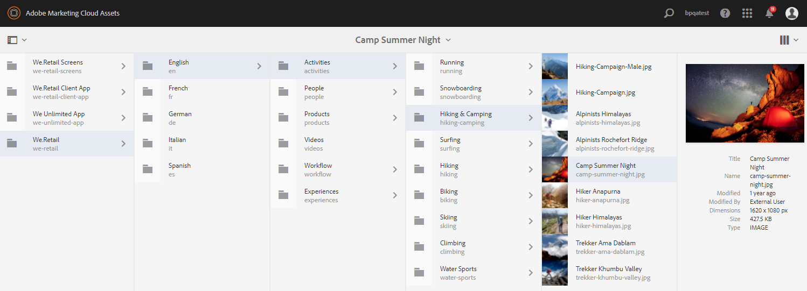

# Novedades de AEM Assets Brand Portal {#what-s-new-in-aem-assets-brand-portal}

Adobe Experience Manager (AEM) Assets Brand Portal le ayuda a adquirir, controlar y distribuir de forma segura recursos creativos aprobados a terceros externos y usuarios empresariales internos entre dispositivos. Ayuda a mejorar la eficiencia del uso compartido de activos, acelera el tiempo de comercialización de los activos y reduce el riesgo de incumplimiento y acceso no autorizado. Adobe está trabajando para mejorar la experiencia general de Brand Portal. A continuación, le presentamos una vista preliminar de las nuevas funciones y mejoras.

## Qué cambió en 2021.02.0 {#what-changed-in-feb-2021}

Brand Portal 2021.02.0 es una versión de mejora que incorpora el flujo de trabajo de automatización de Brand Portal en AEM Assets as a Cloud Service, facilita la función de abastecimiento de recursos en AEM Assets como Cloud Service, mejora la experiencia de descarga de recursos e incluye correcciones críticas. También permite a los administradores configurar el comportamiento de descarga predeterminado de carpetas, colecciones y descargas masivas de recursos a nivel de inquilino. El **[!UICONTROL Informe de uso]** de Brand Portal también se ha modificado para reflejar a los usuarios activos de Brand Portal. Consulte las últimas [Notas de la versión de Brand Portal](brand-portal-release-notes.md).

### Automatización de Brand Portal en AEM Assets as a Cloud Service {#bp-automation-on-cloud-service}

AEM Assets as a Cloud Service se configura automáticamente con Brand Portal activando Brand Portal desde Cloud Manager. Un usuario de Cloud Manager déclencheur el flujo de trabajo de activación que crea las configuraciones necesarias en el servidor y activa Brand Portal en la misma organización de IMS que la de AEM Assets como instancia de Cloud Service.

Anteriormente, AEM Assets as a Cloud Service se configuraba manualmente con Brand Portal mediante Adobe Developer Console, que proporciona un token de Identity Management Services (IMS) de Adobe para la autorización del inquilino de Brand Portal.

Consulte [Activación de Brand Portal en AEM Assets as a Cloud Service](https://experienceleague.adobe.com/docs/experience-manager-cloud-service/assets/brand-portal/configure-aem-assets-with-brand-portal.html?lang=en).

### Abastecimiento de recursos en AEM Assets as a Cloud Service {#asset-sourcing-on-cloud-service}

La función de abastecimiento de recursos ya está disponible en AEM Assets as a Cloud Service. La función está habilitada de forma predeterminada para todos los usuarios de servicios en la nube. Los usuarios permitidos de Brand Portal pueden contribuir al abastecimiento de recursos cargando nuevos recursos en las carpetas de contribución y publicando la carpeta de contribución de Brand Portal en AEM Assets as a Cloud Service. Los administradores pueden revisar y aprobar la contribución de los usuarios de Brand Portal para distribuirla a otros usuarios de Brand Portal.

Anteriormente, el abastecimiento de recursos solo estaba disponible en AEM Assets (servicio local y administrado).

Consulte [Abastecimiento de recursos en Brand Portal](https://experienceleague.adobe.com/docs/experience-manager-brand-portal/using/asset-sourcing-in-brand-portal/brand-portal-asset-sourcing.html?lang=en).

### Descarga de recurso {#asset-download-setting}

Además de la **[!UICONTROL Configuración de descarga]** existente, los administradores de Brand Portal ahora pueden configurar la configuración **[!UICONTROL Descarga de recursos]**. Esta configuración permite a los administradores controlar el comportamiento de descarga predeterminado de carpetas, colecciones y descargas masivas de recursos (más de 20 recursos) a nivel de inquilino.

<!--
Earlier, all the asset renditions were directly downloaded in a zip folder in case of folder, collection, and bulk download of assets. As the **[!UICONTROL Download]** dialog is skipped for folders or collections, there was no mechanism to control the downloading behaviour of the assets. Due to this, the users were finding it difficut to search for a particular asset rendition from a folder containing huge bunch of downloaded renditions. 
-->

Anteriormente, todas las representaciones de recursos se descargaban directamente en una carpeta zip. El cuadro de diálogo **[!UICONTROL Descargar]** se omitió para carpetas y colecciones, y no había ningún método para controlar el comportamiento de descarga de los recursos, lo que dificulta la búsqueda de una representación concreta a partir de un gran número de descargas.

**[!UICONTROL La]** configuración de descarga de recursos ahora proporciona una opción para crear una carpeta independiente para cada recurso al descargar las carpetas, colecciones o descargas masivas de recursos.

Si la configuración **[!UICONTROL Asset Download]** está deshabilitada, las carpetas o colecciones se descargan en una carpeta zip que contiene todas las representaciones de recursos en la misma carpeta, excepto para descargar los recursos mediante el vínculo de uso compartido.

Inicie sesión en el inquilino de Brand Portal como administrador y vaya a **[!UICONTROL Tools]** > **[!UICONTROL Download]**. Los administradores pueden habilitar la configuración **[!UICONTROL Descarga de recursos]** para crear carpetas independientes para cada recurso al descargar carpetas, colecciones y descargas masivas de recursos.

Consulte [descarga de recursos desde Brand Portal](https://experienceleague.adobe.com/docs/experience-manager-brand-portal/using/download/brand-portal-download-assets.html?lang=en).
<!--
### Download using Share link {#download-using-share-link}

The default behavior of downloading the assets using share link is now independent of the **[!UICONTROL Download Settings]**. A separate folder is created for each asset while downloading the assets using share link. 
-->

### Informe de uso {#usage-report}

El **[!UICONTROL Informe de uso]** de Brand Portal se ha modificado para reflejar solamente los usuarios activos de Brand Portal. Los usuarios del portal de marca que no están asignados a ningún perfil de producto en el Admin Console se consideran usuarios inactivos y no se reflejan en el **[!UICONTROL Informe de uso]**.

Anteriormente, los usuarios activos e inactivos se mostraban en el Informe de uso.

## Qué cambió en 2020.10.0 {#what-changed-in-oct-2020}

Brand Portal 2020.10.0 es una versión de mejora que se centra en simplificar la experiencia de descarga de recursos e incluye correcciones críticas. La mejora incluye un flujo de trabajo nuevo y mejorado para la descarga de recursos, opciones adicionales para excluir representaciones, descarga directa desde el panel **[!UICONTROL Representaciones]**, configuración para permitir derechos de acceso y descarga para grupos específicos de usuarios, y fácil navegación para los archivos, colecciones y vínculos compartidos desde todas las páginas de Brand Portal. Consulte las últimas [Notas de la versión de Brand Portal](brand-portal-release-notes.md).

### Experiencia de descarga simplificada {#download-dialog}

Anteriormente, el cuadro de diálogo **[!UICONTROL Descargar]** aparecía con varias opciones, como crear una carpeta independiente para cada recurso, un recurso de correo electrónico, seleccionar un recurso original, representaciones personalizadas, representaciones dinámicas, excluir las representaciones del sistema y habilitar la aceleración de descargas, que eran ambiguas para los usuarios no técnicos o nuevos, especialmente cuando se seleccionaban varios recursos o carpetas para su descarga. Además, el usuario no podía ver todas las representaciones de recursos ni excluir una representación dinámica o personalizada específica.

El nuevo cuadro de diálogo **[!UICONTROL Download]** generaliza el proceso de selección y filtrado de recursos, lo que facilita a los usuarios de Brand Portal la toma de decisiones efectivas mientras descargan las representaciones de recursos. Enumera todos los recursos seleccionados y sus representaciones según la configuración [**[!UICONTROL Download]**](brand-portal-download-assets.md) y la configuración **[!UICONTROL Download]**.

>[!NOTE]
>
>Ahora, todos los usuarios tendrán **[!UICONTROL Fast Download]** habilitado de forma predeterminada y requiere [IBM Aspera Connect 3.9.9](https://www.ibm.com/support/knowledgecenter/SSXMX3_3.9.9/kc/connect_welcome.html) instalado en la extensión de su explorador antes de descargar los recursos de Brand Portal.

<!--
If any of the **[!UICONTROL Custom Rendition]** or **[!UICONTROL System Rendition]** is enabled in the [**[!UICONTROL Download]**](brand-portal-download-assets.md) configuration and **[!UICONTROL Download]** settings are enabled for the group users, the new **[!UICONTROL Download]** dialog appears with all the renditions of the selected assets or folders containing assets in a list view. 
-->

Desde el cuadro de diálogo **[!UICONTROL Descargar]**, los usuarios pueden:

* Vea todas las representaciones disponibles de cualquier recurso en la lista de descargas.
* Excluya las representaciones de los recursos que no sean necesarias para la descarga.
* Aplique el mismo conjunto de representaciones a todos los tipos de recursos similares en un solo clic.
* Aplique un conjunto diferente de representaciones para diferentes tipos de recursos.
* Crear una carpeta independiente para cada recurso.
* Descargue los recursos seleccionados y sus representaciones.

El flujo de trabajo de descarga permanece constante para los recursos independientes, varios recursos, carpetas que contienen recursos, recursos con licencia o sin licencia, y descargar recursos mediante el vínculo de uso compartido. Consulte los [pasos para descargar recursos desde Brand Portal](https://docs.adobe.com/content/help/en/experience-manager-brand-portal/using/download/brand-portal-download-assets.html#download-assets).

### Navegación rápida {#quick-navigation}

Anteriormente, la opción de ver **[!UICONTROL Archivos]**, **[!UICONTROL Colecciones]** y **[!UICONTROL Vínculos compartidos]** estaban ocultas y requerían varios clics cada vez que el usuario quería cambiar a otra vista.

En Brand Portal 2020.10.0, los usuarios pueden navegar a **[!UICONTROL Files]**, **[!UICONTROL Collections]** y **[!UICONTROL Shared Links]** desde todas las páginas de Brand Portal en un solo clic utilizando los vínculos de navegación rápida.

### Panel de representación mejorado {#rendition-panel}

Antes, los usuarios solo podían ver el recurso original y sus representaciones en el panel **[!UICONTROL Representaciones]** si alguna de las opciones **[!UICONTROL Representación personalizada]** o **[!UICONTROL Representación del sistema]** estaba habilitada en la configuración **[!UICONTROL Descargar]**. Además, los usuarios tuvieron que descargar todas las representaciones de recursos, ya que no había ningún filtro para excluir representaciones personalizadas o dinámicas específicas que no eran necesarias.

<!--
Earlier, if any of the custom or system renditions was enabled in the **[!UICONTROL Download]** settings, an additional **[!UICONTROL Download]** dialog appeared on clicking the **[!UICONTROL Download]** button wherein the user had to manually select the set of renditions (original asset, custom renditions, dynamic renditions) to download.
There was no filter to exclude specific custom or dynamic renditions which were not required for download.
-->

En Brand Portal 2020.10.0, los usuarios pueden excluir representaciones específicas y [descargar directamente las representaciones seleccionadas del panel Representaciones](brand-portal-download-assets.md#download-assets-from-asset-details-page) en la página de detalles del recurso sin tener que abrir el cuadro de diálogo **[!UICONTROL Descargar]** .

<!-- 
In Brand Portal 2020.10.0, direct download and exclude renditions features are introduced in the **[!UICONTROL Renditions]** panel on the asset details page. All the renditions (original asset, custom renditions, dynamic renditions) under the rendition panel are now associated with a check box and are enabled by default. 

The user can clear the check boxes to exclude the renditions which are not required for download. And can click on the **[!UICONTROL Download]** button in the **[!UICONTROL Renditions]** panel to directly download the selected set of renditions in a zip folder without having to open the **[!UICONTROL Download]** dialog.
-->

### Configurar la configuración de descarga {#download-permissions}

Además de las configuraciones existentes de **[!UICONTROL Descargar]**, los administradores de Brand Portal también pueden configurar opciones para que distintos grupos de usuarios vean y (o) descarguen el recurso original y sus representaciones desde la página de detalles del recurso.

Inicie sesión en el inquilino de Brand Portal como administrador y vaya a **[!UICONTROL Tools]** > **[!UICONTROL Users]**.

En la página **[!UICONTROL Funciones de usuario]**, vaya a la pestaña **[!UICONTROL Grupos]** para configurar la configuración de vista y (o) descarga de los grupos de usuarios.

Anteriormente, la configuración solo estaba disponible para restringir la descarga del recurso original por parte de los usuarios del grupo.

La pestaña **[!UICONTROL Grupos]** de la página **[!UICONTROL Funciones de usuario]** permite a los administradores configurar las opciones de visualización y descarga:

* Si las opciones **[!UICONTROL Descargar original]** y **[!UICONTROL Descargar representaciones]** están activadas, los usuarios del grupo seleccionado pueden ver y descargar los recursos originales y sus representaciones.
* Si ambas opciones de configuración están desactivadas, los usuarios solo podrán ver los recursos originales. Las representaciones de recursos no son visibles para los usuarios en la página de detalles del recurso.
* Si solo está activada la opción **[!UICONTROL Descargar original]** , los usuarios pueden ver y descargar solo los recursos originales desde la página de detalles del recurso.
* Si solo está activada la configuración **[!UICONTROL Download Renditions]** , los usuarios pueden ver el recurso original, pero no pueden descargarlo. Sin embargo, el usuario puede ver y descargar las representaciones de recursos.

Consulte [configurar descarga de recursos](https://docs.adobe.com/content/help/en/experience-manager-brand-portal/using/download/brand-portal-download-assets.html#configure-download-permissions).

>[!NOTE]
>
>Si un usuario se agrega a varios grupos y uno de ellos tiene restricciones, las restricciones se aplicarán al usuario.

<!--
>Restrictions to access the original asset and their renditions do not apply to administrators even if they are members of restricted groups.
 >
 >The users can always download assets and their renditions from the repository using a `curl` request even if the download configurations are turned-off.
 >
-->

## Qué ha cambiado en 6.4.7 {#what-changed-in-647}

La versión 6.4.7 de Brand Portal incorpora el visualizador de documentos, mejora la experiencia de descarga de recursos e incluye correcciones críticas. Consulte las últimas [Notas de la versión de Brand Portal](brand-portal-release-notes.md).

<!--
Brand Portal 6.4.7 release brings in the Document Viewer, leverages the Brand Portal administrators to configure asset download, and centers top customer requests. See latest [Brand Portal Release Notes](brand-portal-release-notes.md).
-->

### Visor de documentos {#doc-viewer}

El visualizador de documentos mejora la experiencia de visualización de PDF. Proporciona una experiencia similar a la de Adobe Document Cloud mientras ve los archivos PDF en Brand Portal.

Anteriormente, había pocas opciones disponibles para ver los archivos PDF.

Con el Visor de documentos, los usuarios de Brand Portal tienen ahora la opción de ver páginas, ver marcadores, buscar texto en la página, acercar, alejar, navegar a las páginas anteriores y siguientes, cambiar a la página, ajustar a la ventana, ajustar a la pantalla y ocultar o mostrar la barra de herramientas.

>[!NOTE]
>
>La experiencia de visualización de otros formatos de documento permanece sin cambios.

### Descargar experiencia {#download-configurations}

El proceso de descarga de recursos se ha rediseñado y proporciona una experiencia de usuario simplificada mientras [descarga recursos desde Brand Portal](brand-portal-download-assets.md).

El flujo de trabajo existente de descarga de recursos desde Brand Portal va seguido inevitablemente de la aparición de un cuadro de diálogo de **[!UICONTROL Descargar]** con varias opciones de descarga entre las que elegir.

En Brand Portal 6.4.7, los administradores de Brand Portal pueden configurar la configuración **[!UICONTROL Download]** del recurso. Las configuraciones disponibles son:
* **[!UICONTROL Descarga rápida]**
* **[!UICONTROL Representaciones personalizadas]**
* **[!UICONTROL Representaciones del sistema]**

El administrador de Brand Portal puede habilitar cualquier combinación para configurar la descarga de recursos.

<!--In Brand Portal 6.4.7, fast download, custom renditions, and system renditions are the three configurations available.-->

* Si las configuraciones **[!UICONTROL Representaciones personalizadas]** y **[!UICONTROL Representaciones del sistema]** están desactivadas, las representaciones originales de los recursos se descargan sin ningún cuadro de diálogo adicional que simplifique la experiencia de descarga para los usuarios de Brand Portal.

* Si se habilita cualquiera de las opciones **[!UICONTROL Representación personalizada]** o **[!UICONTROL Representación del sistema]**, aparecerá el cuadro de diálogo **[!UICONTROL Descargar]** y se descargarán el recurso original junto con las representaciones de recursos. Al habilitar la configuración de **[!UICONTROL Fast Download]** se acelera el proceso de descarga.

En función de la configuración, el flujo de trabajo de descarga permanece constante para los recursos independientes, varios recursos, carpetas que contengan recursos, recursos con licencia o sin licencia y descarga de recursos mediante el vínculo de uso compartido.

## Qué ha cambiado en 6.4.6 {#what-changed-in-646}

En Brand Portal 6.4.6, se cambia el canal de autorización entre AEM Assets y Brand Portal. Brand Portal ahora es compatible con AEM Assets as a Cloud Service, AEM Assets 6.3 y versiones posteriores. En AEM Assets 6.3 y versiones posteriores, Brand Portal se configuró anteriormente en la IU clásica mediante la puerta de enlace OAuth heredada, que utiliza el intercambio de tokens JWT para obtener un token de acceso IMS para la autorización. AEM Assets ahora se configura con Brand Portal a través de Adobe Developer Console, que obtiene un testigo IMS para la autorización del inquilino de Brand Portal.

<!-- The steps to configure integration are different depending on your AEM version, and whether you are configuring for the first-time, or upgrading the existing integration:
-->

<!--
  
   | **AEM Version** |**New Integration** |**Upgrade Integration** |
|---|---|---|
| **AEM 6.5** |[Create new integration](../using/brand-portal-configure-integration-65.md) |[Upgrade existing integration](../using/brand-portal-configure-integration-65.md#upgrade-integration-65) | 
| **AEM 6.4** |[Create new integration](../using/brand-portal-configure-integration-64.md) |[Upgrade existing integration](../using/brand-portal-configure-integration-64.md#upgrade-integration-64) | 
| **AEM 6.3** |[Create new integration](../using/brand-portal-configure-integration-63.md) |[Upgrade existing integration](../using/brand-portal-configure-integration-63.md#upgrade-integration-63) | 
| **AEM 6.2** |Contact Support |Contact Support | 

   -->

Los pasos para configurar AEM Assets con Brand Portal son diferentes en función de la versión de AEM y de si está configurando por primera vez o actualizando las configuraciones existentes:

<!--| **AEM Version** |**New Configuration** |**Upgrade Configuration** |
|---|---|---|
| **AEM 6.5 (6.5.4.0 and above)** |[Create configuration](../using/brand-portal-configure-integration-65.md) |[Upgrade configuration](../using/brand-portal-configure-integration-65.md#upgrade-integration-65) | 
| **AEM 6.4 (6.4.8.0 and above)** |[Create configuration](../using/brand-portal-configure-integration-64.md) |[Upgrade configuration](../using/brand-portal-configure-integration-64.md#upgrade-integration-64) | 
| **AEM 6.3 (6.3.3.8 and above)** |[Create configuration](../using/brand-portal-configure-integration-63.md) |[Upgrade configuration](../using/brand-portal-configure-integration-63.md#upgrade-integration-63) | 
| **AEM 6.2** |Contact Support |Contact Support | 
-->

<!-- AEM Assets configuration with Brand Portal on Adobe I/O is supported on:
* AEM 6.5.4.0 and above
* AEM 6.4.8.0 and above
* AEM 6.3.3.8 and above -->

| **Versión de AEM** | **Nueva configuración** | **Configuración de actualización** |
|---|---|---|
| **AEM Assets as a Cloud Service** | [Crear configuración](https://docs.adobe.com/content/help/es-ES/experience-manager-cloud-service/assets/brand-portal/configure-aem-assets-with-brand-portal.html) | - |
| **AEM 6.5 (6.5.4.0 y posterior)** | [Crear configuración](https://docs.adobe.com/content/help/es-ES/experience-manager-65/assets/brandportal/configure-aem-assets-with-brand-portal.html) | [Actualización de la configuración](https://docs.adobe.com/content/help/es-ES/experience-manager-65/assets/brandportal/configure-aem-assets-with-brand-portal.html#upgrade-integration-65) |
| **AEM 6.4 (6.4.8.0 y posterior)** | [Crear configuración](https://docs.adobe.com/content/help/es-ES/experience-manager-64/assets/brandportal/configure-aem-assets-with-brand-portal.html) | [Actualización de la configuración](https://docs.adobe.com/content/help/es-ES/experience-manager-64/assets/brandportal/configure-aem-assets-with-brand-portal.html#upgrade-integration-64) |
| **AEM 6.3 (6.3.3.8 y posterior)** | [Crear configuración](https://helpx.adobe.com/es/experience-manager/6-3/assets/using/brand-portal-configuring-integration.html) | [Actualización de la configuración](https://helpx.adobe.com/es/experience-manager/6-3/assets/using/brand-portal-configuring-integration.html#Upgradeconfiguration) |
| **AEM 6.2** | Contacto con el servicio de asistencia | Contacto con el servicio de asistencia |

>[!NOTE]
>
>Se recomienda actualizar la instancia de AEM al Service Pack más reciente.

Consulte las últimas [Notas de la versión de Brand Portal](brand-portal-release-notes.md).

Consulte [Preguntas frecuentes de Brand Portal](brand-portal-faqs.md).

## Qué ha cambiado en 6.4.5 {#what-changed-in-645}

Brand Portal 6.4.5 es una versión de funciones que se centra en proporcionar a los usuarios de Brand Portal (agencias/equipos externos) la capacidad de cargar contenido en Brand Portal y publicarlo en AEM Assets, sin la necesidad de acceder al entorno de creación. Esta función se denomina **[Asset Sourcing en Brand Portal](brand-portal-asset-sourcing.md)** y mejorará las experiencias de los clientes al proporcionar un mecanismo bidireccional para que los usuarios contribuyan y compartan recursos con otros usuarios de Brand Portal distribuidos globalmente.

### Abastecimiento de recursos en Brand Portal {#asset-sourcing-in-bp}

La fuente de recursos permite a los usuarios AEM (administradores/usuarios no administradores) crear nuevas carpetas con una propiedad **Asset Contribution** adicional, lo que garantiza que la nueva carpeta creada esté abierta al envío de recursos por parte de los usuarios de Brand Portal. Esto déclencheur automáticamente un flujo de trabajo que crea dos subcarpetas adicionales, llamadas NUEVAS y COMPARTIDAS, dentro de la carpeta **Contribution** recién creada.

A continuación, el usuario AEM define el requisito cargando un resumen sobre los tipos de recursos que deben agregarse a la carpeta de contribución, así como cargando recursos de línea base, a la carpeta **SHARED** para garantizar que los usuarios de BP tengan la información de referencia que necesitan. A continuación, el administrador puede otorgar a los usuarios activos de Brand Portal acceso a la carpeta de contribución antes de publicar la carpeta **Contribution** recién creada en Brand Portal.

Una vez que el usuario ha terminado de añadir contenido en la carpeta **NEW** , puede volver a publicar la carpeta de contribución en el entorno de creación de AEM. Tenga en cuenta que puede tardar unos minutos en completar la importación y reflejar el contenido recién publicado en AEM Assets.

Además, todas las funcionalidades existentes permanecen inalteradas. Los usuarios de Brand Portal pueden ver, buscar y descargar recursos de la carpeta de contribución, así como de otras carpetas permitidas. Y los administradores pueden compartir aún más la carpeta de contribución, modificar las propiedades y añadir recursos a las colecciones.

>[!NOTE]
>
>El abastecimiento de recursos en Brand Portal es compatible con AEM 6.5.2.0 y versiones posteriores.
>
>La función no es compatible con versiones anteriores: AEM 6.3 y AEM 6.4.

### Cargar recursos a la carpeta de contribución {#upload-assets-in-bp}

Los usuarios de Brand Portal con los permisos adecuados pueden descargar los requisitos de recursos para comprender la necesidad de la contribución y cargar varios recursos o carpetas que contengan varios recursos en la carpeta de contribución. Sin embargo, tenga en cuenta que los usuarios de Brand Portal solo pueden cargar recursos en la subcarpeta **NEW** . La carpeta **SHARED** está diseñada para la distribución de requisitos y recursos de línea de base.

### Publicar carpeta de contribución en AEM Assets {#publish-assets-to-aem}

Una vez completada la carga en la carpeta **NEW** , los usuarios de Brand Portal pueden volver a publicar la carpeta de contribución en AEM. Puede tardar unos minutos en importar y reflejar el contenido o los recursos publicados en AEM Assets. Consulte [Publicar carpeta de contribución en AEM Assets](brand-portal-publish-contribution-folder-to-aem-assets.md)

## Cambios en la versión 6.4.4 {#what-changed-in-644}

La versión 6.4.4 de Brand Portal se centra en las mejoras en la búsqueda de texto y en las principales solicitudes de los clientes. Consulte las últimas [Notas de la versión de Brand Portal](brand-portal-release-notes.md).

### Mejoras de búsqueda

A partir de la versión 6.4.4, Brand Portal admite la búsqueda de texto parcial en el predicado de propiedades en el panel de filtrado. Para permitir la búsqueda de texto parcial, debe habilitar la **Búsqueda parcial** en el predicado de propiedades en el formulario de búsqueda.

Continúe leyendo para obtener más información sobre la búsqueda de texto parcial y la búsqueda de comodines.

#### Búsqueda parcial de frases {#partial-phrase-search}

Ahora puede buscar recursos especificando solo una parte (es decir, una palabra o dos) de la frase buscada en el panel de filtrado.

**Utilice la búsqueda de**
frases parciales cuando no esté seguro de la combinación exacta de palabras que se producen en la frase buscada.

Por ejemplo, si el formulario de búsqueda en Brand Portal utiliza Predicado de propiedades para la búsqueda parcial del título de los recursos, al especificar el término **camp** se devuelven todos los recursos con la palabra camp en su frase de título.

#### Búsqueda comodín {#wildcard-search}

Brand Portal permite utilizar el asterisco (*) en la consulta de búsqueda junto con una parte de la palabra de la frase buscada.

**Utilice un**
casoSi no está seguro de las palabras exactas que se producen en la frase buscada, puede utilizar una búsqueda comodín para rellenar los huecos en la consulta de búsqueda.

Por ejemplo, si se especifica **escalar***, se devuelven todos los recursos que tengan palabras que empiecen por los caracteres **escalar** en la frase de título, si el formulario de búsqueda en Brand Portal utiliza el predicado de propiedades para la búsqueda parcial del título de los recursos.

Del mismo modo, especificando:

* ***** escalar devuelve todos los recursos que tienen palabras que terminan con caracteres que  **** escalan en su frase de título.

* ***escalar*** devuelve todos los recursos que tienen palabras que comprenden los caracteres que  **** escalan en su frase de título.

>[!NOTE]
>
>Al seleccionar la casilla de verificación **Búsqueda parcial**, **Ignorar mayúsculas y minúsculas** está seleccionada de forma predeterminada.

## Qué ha cambiado en 6.4.3 {#what-changed-in}

La versión 6.4.3 de Brand Portal se centra en: proporcionar a las organizaciones un alias alternativo, además de su ID de inquilino en la URL de acceso a Brand Portal, nueva configuración de la jerarquía de carpetas, mejoras en la compatibilidad con vídeo, publicación programada de la instancia de AEM Author a Brand Portal, mejoras operativas, y atiende las solicitudes de los clientes.

### Navegación de jerarquía de carpetas para usuarios que no son administradores

Los administradores ahora pueden configurar cómo se muestran las carpetas a los usuarios no administradores (editores, visualizadores y usuarios invitados) al iniciar sesión. [La opción Habilitar ](../using/brand-portal-general-configuration.md) jerarquía de carpetas se agrega en Configuración  **general**, en el panel Herramientas de administración. Si la configuración es:

* **habilitado**, el árbol de carpetas que comienza desde la carpeta raíz es visible para los usuarios que no son administradores. Por lo tanto, concederles una experiencia de navegación similar a la de los administradores.
* **desactivado**, solo las carpetas compartidas se muestran en la página de aterrizaje.

La funcionalidad [Habilitar jerarquía de carpetas](../using/brand-portal-general-configuration.md) (cuando está habilitada) ayuda a diferenciar las carpetas con los mismos nombres compartidos de jerarquías diferentes. Al iniciar sesión, los usuarios no administradores ven ahora las carpetas principales virtuales (y antecesoras) de las carpetas compartidas.

Las carpetas compartidas están organizadas dentro de los directorios respectivos en carpetas virtuales. Puede reconocer estas carpetas virtuales con un icono de bloqueo.

Tenga en cuenta que la miniatura predeterminada de las carpetas virtuales es la imagen en miniatura de la primera carpeta compartida.

### Buscar en una jerarquía de carpetas o ruta específica

**Path** Browserpredicate se introduce en el formulario de búsqueda para permitir la búsqueda de recursos en un directorio específico. La ruta de búsqueda predeterminada del predicado de búsqueda para el explorador de rutas es `/content/dam/mac/<tenant-id>/`, que se puede configurar editando el formulario de búsqueda predeterminado.

* Los usuarios administradores pueden utilizar el explorador de rutas para navegar a cualquier directorio de carpetas en Brand Portal.
* Los usuarios no administradores pueden utilizar el explorador de rutas para navegar únicamente a las carpetas (y volver a las carpetas principales) compartidas con ellos.

   Por ejemplo, `/content/dam/mac/<tenant-id>/folderA/folderB/folderC` se comparte con un usuario no administrador. El usuario puede buscar recursos dentro de folderC mediante el explorador de rutas. Este usuario también puede navegar a folderB y a folderA (ya que son antecesores de la carpeta C que se comparte con el usuario).

Ahora puede restringir la búsqueda de recursos dentro de una carpeta específica a la que ha navegado, en lugar de comenzar en la carpeta raíz.

Tenga en cuenta que al buscar en estas carpetas, solo se devuelven los recursos que se han compartido con el usuario.

### Compatibilidad con representaciones de vídeo de Dynamic Media

Los usuarios cuya instancia de AEM Author esté en modo híbrido Dynamic Media pueden obtener una vista previa y descargar las representaciones de Dynamic Media, además de los archivos de vídeo originales.

Para permitir la previsualización y descarga de representaciones de Dynamic Media en cuentas de inquilino específicas, los administradores deben especificar **Dynamic Media Configuration** (URL del servicio de vídeo (DM-Gateway URL) e ID de registro para recuperar el vídeo dinámico) en la configuración de **Video** del panel de herramientas de administración.

Los vídeos de Dynamic Media se pueden previsualizar en:

* Página de detalles del recurso
* Vista de tarjeta del recurso
* Vincular página de vista previa de uso compartido

Las codificaciones de vídeo de Dynamic Media se pueden descargar desde:

* Brand Portal
* Vínculo compartido

### Publicación programada en Brand Portal

El flujo de trabajo de publicación de recursos (y carpetas) desde [AEM (6.4.2.0)](https://helpx.adobe.com/experience-manager/6-4/release-notes/sp-release-notes.html#main-pars_header_9658011) La instancia de autor en Brand Portal se puede programar para una fecha y hora posteriores.

Del mismo modo, los recursos publicados se pueden eliminar del portal en una fecha (hora) posterior, programando el flujo de trabajo Cancelar publicación desde Brand Portal .

### Alias de inquilino configurable en la dirección URL

Las organizaciones pueden personalizar la dirección URL del portal si tienen un prefijo alternativo en la dirección URL. Para obtener un alias para el nombre de inquilino en la URL de su portal existente, las organizaciones deben ponerse en contacto con el servicio de asistencia técnica de Adobe.

Tenga en cuenta que solo se puede personalizar el prefijo de la dirección URL de Brand Portal y no toda la dirección URL.\
Por ejemplo, una organización con el dominio existente **geomettrix.brand-portal.adobe.com** puede obtener **geomettrixinc.brand-portal.adobe.com** creado si se solicita.

Sin embargo, la instancia de Autor de AEM solo puede [configurarse](https://helpx.adobe.com/es/experience-manager/6-5/assets/using/brand-portal-configuring-integration.html) con la dirección URL de identificación del inquilino y no con la dirección URL de alias del inquilino (alternativa).

Las organizaciones pueden satisfacer sus necesidades de promoción de la marca personalizando la URL del portal, en lugar de atenerse a la URL proporcionada por Adobe.

### Descargar mejoras de experiencia

La versión ofrece una experiencia de descarga simplificada con un número reducido de clics y advertencias, en:

* Optar por descargar solo las representaciones (y no los recursos originales).
* La descarga de los recursos cuando el acceso a las representaciones originales está restringido.

## Qué ha cambiado en 6.4.2 {#what-changed-in-1}

La versión 6.4.2 de Brand Portal ofrece una amplia gama de funciones para satisfacer las necesidades de distribución de recursos de las organizaciones y ayudarles a llegar a un gran número de usuarios distribuidos globalmente mediante Acceso de invitado y una experiencia óptima con descargas aceleradas. Brand Portal también proporciona bueno control a las organizaciones a través de nuevas configuraciones para administradores, informes recién agregados y atención a las solicitudes de los clientes.

### Acceso de invitado

AEM Brand Portal permite a los invitados acceder al portal. Un usuario invitado no necesita credenciales para entrar al portal y puede acceder y descargar todas las carpetas y colecciones públicas. Los usuarios invitados pueden agregar recursos a Lightbox (colección privada) y descargar los mismos. También pueden ver los predicados de búsqueda y búsqueda de etiquetas inteligentes establecidos por los administradores. La sesión de invitado no permite a los usuarios crear colecciones y guardar búsquedas ni compartirlas más, acceder a la configuración de carpetas y colecciones y compartir recursos como vínculos.

En una organización, se permiten varias sesiones de invitados simultáneas, lo que se limita al 10 % de la cuota de usuario total por organización.

Una sesión de invitado permanece activa durante dos horas. Por lo tanto, el estado de Lightbox también se conserva hasta dos horas después del inicio de la sesión. Después de dos horas, la sesión de invitado debe reiniciarse, por lo que se pierde el estado Lightbox.

### Descargas aceleradas

Los usuarios de Brand Portal pueden aprovechar las rápidas descargas basadas en IBM Aspera Connect para obtener velocidades hasta 25 veces más rápidas y disfrutar de una experiencia de descarga perfecta independientemente de su ubicación en todo el mundo. Para descargar los recursos más rápido desde Brand Portal o el vínculo compartido, los usuarios deben seleccionar la opción **Habilitar aceleración de descarga** en el cuadro de diálogo de descarga, siempre que la aceleración de descarga esté habilitada en su organización.

Para habilitar la descarga acelerada basada en IBM Aspera para la organización, los administradores de la opción **Habilitar aceleración de descarga** (que está deshabilitada de forma predeterminada) de [Configuración general](brand-portal-general-configuration.md#allow-download-acceleration) en el panel de herramientas administrativas. Para obtener más información sobre los requisitos previos y los pasos de solución de problemas para descargar archivos de recursos más rápido desde Brand Portal y vínculos compartidos, consulte la [Guía para acelerar las descargas desde Brand Portal](../using/accelerated-download.md#main-pars-header).

### Informe de inicios de sesión de usuario

Se ha introducido un nuevo informe para realizar un seguimiento de los inicios de sesión de los usuarios. El informe **Inicios de sesión de usuario** puede ser fundamental para que las organizaciones puedan auditar y verificar los administradores delegados y otros usuarios de Brand Portal.

Los registros de informes muestran los nombres, los ID de correo electrónico, las personas (administrador, visor, editor, invitado), los grupos, el último inicio de sesión, el estado de la actividad y el recuento de inicios de sesión de cada usuario desde la implementación de Brand Portal 6.4.2 hasta el momento de la generación del informe. Los administradores pueden exportar el informe como .csv. Junto con otros informes, el informe de inicios de sesión de usuario permite a las organizaciones supervisar de forma más estrecha las interacciones de los usuarios con los recursos de marca aprobados, lo que garantiza la conformidad con las oficinas de cumplimiento corporativo.

### Acceso a las representaciones originales

Los administradores pueden restringir el acceso de los usuarios a los archivos de imagen originales (.jpeg, .tiff, .png, .bmp, .gif, .pjpeg, x-portable-anymap, x-portable-bitmap, x-portable-graymap, x-portable-pixmap, x-rgb, x-xbitmap, x-pixmap, x-icon, image/photoshop, image/x-photoshop, psd, image/vnd.adobe.photoshop) y proporciona acceso a representaciones de baja resolución que descargan desde Brand Portal o enlace compartido. Este acceso se puede controlar a nivel de grupo de usuarios desde la ficha Grupos de la página Funciones de usuario del panel Herramientas de administración.

* De forma predeterminada, todos los usuarios pueden descargar representaciones originales, ya que el acceso al original está habilitado para todos.
* Los administradores deben anular la selección de las casillas de verificación correspondientes para evitar que un grupo de usuarios acceda a las representaciones originales.
* Si un usuario es miembro de varios grupos, pero solo uno de ellos tiene restricciones, las restricciones se aplican a ese usuario.
* Las restricciones no se aplican a los administradores, aunque sean miembros de grupos restringidos.
* Los permisos del usuario que comparte recursos como vínculo se aplican a los usuarios que descargan recursos mediante vínculos compartidos.

### Ruta de jerarquía de carpetas en las vistas de tarjeta y lista

Las tarjetas de carpetas, en la vista de tarjeta, ahora muestran información sobre la jerarquía de carpetas a los usuarios que no son administradores (Editor, Visualizador y Usuario invitado). Esta funcionalidad permite a los usuarios conocer la ubicación de las carpetas a las que acceden, con respecto a la jerarquía principal.

La información sobre la jerarquía de carpetas es especialmente útil para diferenciar las carpetas que tienen nombres similares a otras carpetas compartidas desde una jerarquía de carpetas diferente. Si los usuarios que no son administradores no conocen la estructura de carpetas de los recursos compartidos con ellos, los recursos o carpetas con nombres similares parecen confusos.

* Las rutas mostradas en las tarjetas respectivas se truncan para adaptarse a los tamaños de las tarjetas. Sin embargo, los usuarios pueden ver la ruta completa como información del objeto al pasar el ratón por encima de la ruta truncada.

La vista de lista muestra la ruta de la carpeta de los recursos en una columna para todos los usuarios de Brand Portal.

### Opción Información general para ver las propiedades de los recursos

Brand Portal proporciona la opción Información general a los usuarios no administradores (editores, visualizadores, usuarios invitados) para ver las Propiedades de los recursos o carpetas seleccionados. La opción Información general está visible:

1. En la barra de herramientas de la parte superior, seleccione un recurso o una carpeta.
2. En la lista desplegable al seleccionar el Selector de carril.

Al seleccionar la opción Información general mientras se selecciona un recurso o carpeta, los usuarios pueden ver el título, la ruta y la hora de creación de los recursos. Por su parte, en la página de detalles del recurso, seleccionar la opción Información general permite que los usuarios vean los metadatos del recurso.

## Nuevas configuraciones

Se añaden seis nuevas configuraciones para que los administradores habiliten o deshabiliten las siguientes funcionalidades en inquilinos específicos:

* Permitir el acceso de invitados
* Permitir que los usuarios soliciten acceso a Brand Portal
* Permitir que los administradores eliminen recursos de Brand Portal
* Permitir la creación de colecciones públicas
* Permitir la creación de colecciones inteligentes públicas
* Permitir aceleración de descargas

Las configuraciones anteriores están disponibles en Acceso y Configuración general en el panel Herramientas administrativas .

### IU de Adobe I/O para configurar integraciones de oAuth

A partir de la versión 6.4.2 de Brand Portal, utiliza la interfaz Adobe.io [https://legacy-oauth.cloud.adobe.io/](https://legacy-oauth.cloud.adobe.io/) para crear la aplicación JWT, que permite configurar integraciones oAuth para permitir la integración de AEM Assets con Brand Portal. Anteriormente, la interfaz de usuario para configurar integraciones de OAuth estaba alojada en `https://marketing.adobe.com/developer/`. Para obtener más información sobre la integración de AEM Assets con Brand Portal para la publicación de recursos y colecciones en Brand Portal, consulte [Configuración de la integración de AEM Assets con Brand Portal](https://docs.adobe.com/content/help/en/experience-manager-64/assets/brandportal/configure-aem-assets-with-brand-portal.html).

## Mejoras de búsqueda

Los administradores pueden hacer que los predicados de propiedades no distingan entre mayúsculas y minúsculas mediante el predicado de propiedades actualizado, que comprueba si hay mayúsculas y minúsculas. Esta opción está disponible para predicado de propiedades y predicado de propiedades de varios valores.\
Sin embargo, la búsqueda que no distingue entre mayúsculas y minúsculas es comparativamente más lenta que la búsqueda predeterminada del predicado de propiedades. Si hay demasiados predicados que no distinguen entre mayúsculas y minúsculas en el filtro de búsqueda, la búsqueda puede ralentizarse. Por lo tanto, se recomienda utilizar la búsqueda que no distingue entre mayúsculas y minúsculas de forma sensata.

## Qué ha cambiado en 6.4.1 {#what-changed-in-2}

Brand Portal 6.4.1 es una versión de actualización de plataforma que incorpora varias funciones nuevas y mejoras esenciales, como exploraciones, búsquedas y mejoras de rendimiento, para ofrecer experiencias de cliente satisfactorias.

### Mejoras en la exploración

* Nuevo carril del árbol de contenido para desplazarse rápidamente por la jerarquía de recursos.

* Se han introducido nuevos métodos abreviados del teclado, por ejemplo _(p)_ para la navegación a la página de propiedades, _(e)_ para la edición y _(ctrl+c)_ para las operaciones de copia.
* Se ha mejorado el desplazamiento y la experiencia de carga diferida en la vista de tarjeta y lista para explorar un gran número de recursos.
* Vista de tarjeta mejorada con compatibilidad para tarjetas de tamaño diferente según la configuración de visualización.

* La vista de tarjeta ahora muestra la marca de fecha y hora al pasar el ratón por encima de la etiqueta de fecha.

* Vista de columna mejorada con **Más detalles** en la instantánea de recursos, que le permite navegar a la página de detalles de un recurso.

* La vista de lista ahora muestra los nombres de archivo de los recursos en la primera columna de forma predeterminada, además de la configuración regional, el tipo de recurso, las dimensiones, el tamaño, la clasificación y la información de publicación. Se puede utilizar la nueva **Configuración de vista** para configurar la cantidad de detalle que se mostrará en la vista de lista.

* Se ha mejorado la experiencia de detalles de recursos, que permite navegar hacia atrás y adelante entre recursos mediante los nuevos botones de navegación y ver el recuento de recursos.

* Nueva capacidad para previsualizar archivos de audio, cargados desde AEM, en la página de detalles del recurso.
* La nueva capacidad Recursos relacionados se proporciona en las propiedades de los recursos. Los recursos relacionados con otros recursos de origen o derivados en AEM y publicados en Brand Portal ahora tienen su relación intacta en Brand Portal, con vínculos a los recursos relacionados en la página de propiedades.
* Se ha introducido una nueva configuración para restringir la creación de colecciones públicas por parte de los usuarios no administradores. Las organizaciones pueden trabajar con el equipo de asistencia de Adobe para configurar esta capacidad en cuentas específicas.

### Mejoras de búsqueda

* Funcionalidad introducida para volver a la misma posición en los resultados de búsqueda, después de navegar a un elemento de búsqueda, sin volver a ejecutar la consulta de búsqueda.
* Se ha proporcionado un nuevo recuento de resultados de búsqueda para mostrar el número de resultados de búsqueda.
* Se ha mejorado el filtro de búsqueda de tipo de archivo con la capacidad de filtrar los resultados de búsqueda en función de tipos MIME detallados, como .jpg, .png y .psd, en comparación con las opciones anteriores Imágenes, Documentos y Multimedia.
* Filtros de búsqueda mejorados para colecciones, con marcas de tiempo precisas en lugar de la funcionalidad de control deslizante de tiempo anterior.
* Se han introducido nuevos filtros de tipo Acceso para buscar las colecciones que son públicas o no.

### Optimizaciones de descarga

* Un solo archivo grande se descarga directamente, sin la creación de un archivo zip, lo que mejora la velocidad y el rendimiento.
* El límite de descargas zip para la función de compartir vínculos ha aumentado a 5 GB, desde 1 GB.

* Los usuarios ahora pueden elegir descargar solamente los archivos personalizados y originales, y evitar representaciones predeterminadas, mientras descargan recursos de Brand Portal o a través de la función de vínculos compartidos.

### Mejoras de rendimiento

* Mejora de hasta un 100% en la velocidad de descarga de los recursos.
* Mejora de hasta un 40 % en la respuesta de búsqueda de recursos.
* Mejora de hasta un 40% en el rendimiento de la navegación.

**Nota**: Las mejoras citadas son según las pruebas realizadas en el laboratorio.

### Funciones mejoradas de informes

**Se ha introducido el**
informe Compartir vínculosSe ha introducido un nuevo informe para proporcionar información sobre los vínculos compartidos. El informe Compartir vínculos enumera todas las direcciones URL, a los recursos, compartidas con usuarios internos y externos de la organización en el lapso de tiempo especificado. También indica cuándo se compartió el vínculo, quién lo compartió y cuándo caduca.

**Se ha modificado el punto de entrada para acceder al informe Uso del**
informe ahora se consolidan con otros informes y ahora se puede ver desde la consola Informes de recursos . Para llegar a la consola Informes de recursos , vaya a **Crear/administrar informes** desde el panel de herramientas administrativas.

**La experiencia del usuario mejorada con los**
informesLa interfaz de informes de Brand Portal se ha vuelto más intuitiva e impone bueno control a las organizaciones. Además de crear varios informes, los administradores ahora pueden revisar los informes generados y descargarlos o eliminarlos, ya que estos informes se guardan en Brand Portal.

Cada uno de los informes que se crean se puede personalizar añadiendo o eliminando columnas predeterminadas. Además, se pueden agregar columnas personalizadas a los informes de descarga, caducidad y publicación para controlar su grado de granularidad.

### Herramientas de administración mejoradas

Selector de propiedades mejorado en las herramientas de administración de metadatos, búsqueda e informes con capacidad de avance y exploración para simplificar la experiencia de administración.

### Otras mejoras

* Los recursos publicados en Brand Portal desde AEM 6.3.2.1 y 6.4 ahora se pueden poner a disposición del público para los usuarios generales de Brand Portal marcando la casilla Publicar carpetas públicas en el cuadro de diálogo Replicación de AEM Assets Brand Portal.

* Se notifica a los administradores mediante correos electrónicos de solicitud de acceso, además de las notificaciones en el área de notificación de Brand Portal, si alguien ha solicitado acceso a Brand Portal.

## Qué ha cambiado en 6.3.2 {#what-changed-in-3}

Brand Portal 6.3.2 incluye funciones nuevas y mejoradas orientadas a las principales solicitudes de los clientes y mejoras generales de rendimiento.

### Solicitar acceso a Brand Portal {#request-access-to-brand-portal}

Los usuarios ahora pueden solicitar acceso a Brand Portal utilizando la nueva capacidad **need access** disponible en la pantalla de inicio de sesión de Brand Portal.

Dependiendo de si los usuarios tienen un Adobe ID o necesitan crear un Adobe ID, los usuarios pueden seguir el flujo de trabajo adecuado para enviar una solicitud. Los administradores de productos de Brand Portal reciben dichas solicitudes en su área de notificación y conceden acceso a través de Adobe Admin Console.

Para obtener más información, consulte [Solicitud de acceso a Brand Portal](../using/brand-portal.md#requestaccesstobrandportal).

### Mejora en el informe de recursos descargados {#enhancement-in-the-assets-downloaded-report}

El informe de recursos descargados ahora incluye el recuento de descargas de recursos por usuario dentro del intervalo de fecha y hora especificado. Los usuarios pueden descargar este informe en formato .csv y compilar datos, como el recuento total de descargas de un recurso con licencia.

Para obtener más información, consulte los pasos 3 y 6 en [Creación y administración de informes adicionales](../using/brand-portal-reports.md#createandmanageadditionalreports).

### Notificación de mantenimiento de Brand Portal {#brand-portal-maintenance-notification}

Ahora, Brand Portal muestra un banner de notificación unos días antes de una próxima actividad de mantenimiento. Una notificación de ejemplo:

Para obtener más información, consulte [Notificación de mantenimiento de Brand Portal](https://helpx.adobe.com/experience-manager/brand-portal/using/brand-portal.html#BrandPortalmaintenancenotification).

### Mejora de los recursos con licencia compartidos mediante la función de uso compartido de vínculos {#enhancement-for-licensed-assets-shared-using-the-link-share-feature}

Al descargar recursos con licencia mediante la función de uso compartido de vínculos, ahora se le pedirá que acepte el acuerdo de licencia para esos recursos.

Para obtener más información, consulte el paso 12 en [Compartir recursos como un vínculo](../using/brand-portal-link-share.md#shareassetsasalink).

### Mejora del selector de usuarios {#user-picker-enhancement}

El rendimiento del selector de usuarios ahora está mejorado para satisfacer las necesidades de los clientes con una base de usuarios grande.

### Cambios en la marca de Experience Cloud {#experience-cloud-branding-changes}

Brand Portal ahora se ajusta a la nueva marca Adobe Experience Cloud.

## Qué ha cambiado en 6.3.1 {#what-changed-in-4}

Brand Portal 6.3.1 incluye funciones nuevas y mejoradas orientadas a alinear Brand Portal con AEM.

### Interfaz de usuario {#upgraded-user-interface} actualizada

Para alinear la experiencia de usuario de Brand Portal con AEM, el Adobe está realizando una transición a la interfaz de usuario de Coral 3. Este cambio mejora la facilidad de uso general, incluida la navegación y el aspecto.

#### Experiencia de navegación mejorada {#enhanced-navigational-experience}

* Acceso rápido a las herramientas administrativas a través del nuevo logotipo de Adobe:

* Navegación del producto a través de una superposición:

* Navegación rápida a las carpetas principales:

* Búsqueda y navegación rápidas hasta el contenido y las herramientas necesarios:

### Experiencia de navegación mejorada {#enhanced-browsing-experience}

* Nueva vista de columna para navegar por carpetas anidadas:

 

* En la lista de recursos de una carpeta, el recurso más reciente cargado aparece en la parte superior.

### Experiencia de búsqueda mejorada {#enhanced-search-experience}

* La nueva función de búsqueda Omni facilita el acceso rápido al contenido, la capacidad o las etiquetas relevantes a través de sugerencias automáticas a medida que escribe palabras clave de búsqueda. La búsqueda Omni está disponible en todas las funciones de búsqueda.

* También puede agregar filtros de búsqueda a la búsqueda Omni para reducir aún más la búsqueda y agilizarla.

* La nueva búsqueda basada en la clasificación de recursos le permite buscar recursos con clasificaciones, si se publican desde AEM Assets.
* La nueva función de búsqueda de varios valores acepta varias palabras clave con el operador AND para descubrir los recursos más rápido.
* La nueva capacidad de aumento de búsqueda permite mejorar la relevancia de la búsqueda, de modo que los recursos específicos aparecen en la parte superior de los resultados de búsqueda.
* La nueva función de búsqueda basada en rutas le permite proporcionar la ruta a una carpeta anidada para poder buscar recursos en esa carpeta.

#### Nueva búsqueda basada en etiquetas inteligentes {#new-smart-tags-based-search}

Si las imágenes con etiquetas inteligentes se publican desde AEM Assets en Brand Portal, puede buscar estas imágenes en Brand Portal utilizando los nombres de etiquetas inteligentes como palabras clave de búsqueda. Esta función solo está disponible para archivos.

### Experiencia de descarga mejorada {#enhanced-downloading-experience}

Después de descargar una carpeta anidada, puede conservar la jerarquía de carpetas original. Los recursos de una carpeta anidada se pueden descargar en una única carpeta, en lugar de en carpetas independientes.

### Rendimiento mejorado {#improved-performance}

Las mejoras en las capacidades de navegación, búsqueda y descarga mejoran significativamente el rendimiento de Brand Portal.

### Nueva administración de derechos digitales para los recursos {#new-digital-rights-management-for-assets}

Los administradores pueden establecer la fecha y hora de caducidad de los recursos antes de compartirlos. Cuando un recurso caduca, lo ven los visualizadores y editores, pero no se puede descargar. Cuando caduca un recurso, los administradores reciben una notificación.

### Clasificación de recursos mejorada {#enhanced-asset-sorting}

La ordenación de recursos en una carpeta de la vista de lista ya no está restringida al número de recursos que se muestran en la primera página. Todos los recursos de una carpeta se ordenan, independientemente de si se muestran o no en la primera página.

### Informes mejorados {#reporting-capabilities}

Los administradores pueden crear y administrar tres tipos de informes: recursos descargados, caducados y publicados. También está disponible la capacidad de configurar las columnas de un informe y exportar los informes al formato CSV.

### Metadatos adicionales {#additional-metadata}

Brand Portal 6.3.1 introduce metadatos adicionales, que están a la par con AEM Assets 6.3. Puede utilizar el formulario Editor de esquemas para controlar los metadatos que deben ser visibles en la página Propiedades de los recursos. Los metadatos de los recursos no son visibles para los usuarios que comparten vínculos externos, ya que solo pueden obtener una vista previa y descargar recursos mediante la dirección URL de uso compartido de vínculos.

### Funciones adicionales para administradores {#additional-capabilities-for-administrators}

* Antes de finalizar las personalizaciones del fondo de pantalla de inicio de sesión, los administradores pueden obtener una vista previa de los cambios.

* Una vez que un administrador agrega nuevos usuarios, no necesita aceptar invitaciones para agregarlas a Brand Portal, sino que se añaden automáticamente.

### Nuevas funciones de publicación en AEM Assets 6.3 {#new-publishing-capabilities-in-aem-assets}

* Los administradores de AEM pueden publicar el esquema de metadatos de AEM Assets en Brand Portal mediante AEM 6.3 SP 1-CFP 1 (6.3.1.1), que estará disponible en el cuarto trimestre de 2017.

* Los administradores de AEM pueden publicar todas las etiquetas de AEM Assets en Brand Portal mediante AEM 6.2 SP1-CFP7 y AEM 6.3 SP 1-CFP 1 (6.3.1.1).

* Desde AEM Assets, puede publicar recursos y colecciones que tengan etiquetas, incluidas las etiquetas inteligentes. A continuación, puede buscar estos recursos o colecciones utilizando estas etiquetas como palabras clave de búsqueda en Brand Portal.
